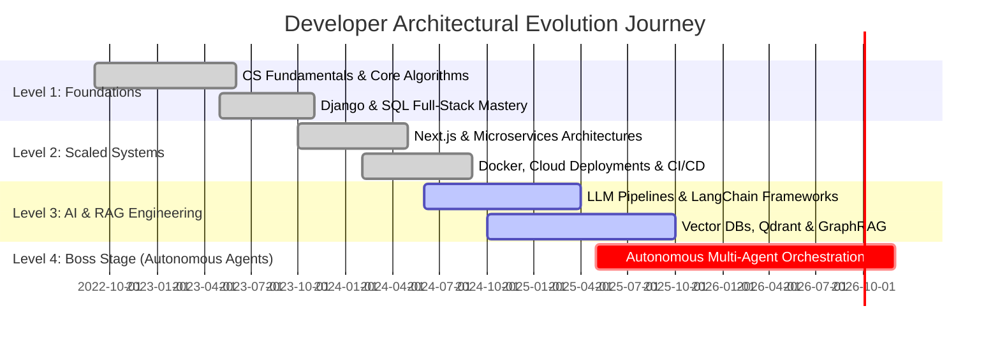

<!-- RETRO TERMINAL & NEOFETCH HEADER -->
<div align="center">
  <table width="100%" border="0" cellspacing="0" cellpadding="10" style="background-color: #0d1117; border: 1.5px solid #30363d; border-radius: 10px;">
    <tr>
      <!-- LEFT COLUMN: REAL PHOTO ASCII ART IN TERMINAL -->
      <td width="48%" valign="top" style="border-right: 1px stroke #21262d;">
        <!-- Typing SVG Banner Command Prompt -->
        <p align="left" style="margin-top: 0; margin-bottom: 6px;">
          
        </p>
        
        <!-- Clean Monospaced Terminal Box with Detailed Photo ASCII Art -->
        <pre style="font-family: 'JetBrains Mono', 'Courier New', monospace; font-size: 8px; line-height: 9.5px; color: #00e5ff; background-color: #050811; padding: 10px; border-radius: 6px; border: 1px solid #1e293b; margin: 0; overflow-x: auto; font-weight: bold;"><b>                 .:::-------:::.              
              .::-#%@@@@@@@@@@@%#-::.          
            .:#@@@@@@@@@@@@@@@@@@@@@#:.        
           -%@@@@@@@@@@@@@@@@@@@@@@@@@%-       
          +@@@@@@@@@@@@@@@@@@@@@@@@@@@@@+      
         *@@@@@@@@@@@@@@@@@@@@@@@@@@@@@@@*     
        :@@@@@@@@@@@@@@@@@@@@@@@@@@@@@@@@@:    
        #@@@@@@@%#===============#%@@@@@@@#    
        %@@@@@@@:                 :@@@@@@@%    
       :@@@@@@%:                   :%@@@@@@:   
       +@@@@@@:   .=============.   :@@@@@@+   
       *@@@@@@:  [█▓▒░SUNGLASS░▒▓█]  :@@@@@@*   
       *@@@@@@:  [█▓▒░GLASSES░▒▓█]  :@@@@@@*   
       +@@@@@@:  [██████]   [██████] :@@@@@@+   
       :@@@@@@%-  '----' || '----' -%@@@@@@:   
        #@@@@@@@:        ||        :@@@@@@@#   
        %@@@@@@@@.       ||       .@@@@@@@@%   
        :@@@@@@@@@-     /\/\     -@@@@@@@@@:   
         *@@@@@@@@@.   ======   .@@@@@@@@@*    
          +@@@@@@@@@-  '----'  -@@@@@@@@@+     
           :@@@@@@@@@\________/@@@@@@@@@:      
            .-%@@@@@@@@@@@@@@@@@@@@@@%-.       
          .:--|  \@@@@@@@@@@@@@@@@/  |--:.     
        .:| | |   \@@@@@@@@@@@@@@/   | | |:.   
       /| | | |    \============/    | | | |\  
      / | | | |     |  STRIPED |    | | | | \ 
     /  | | | |     |  COLLAR  |    | | | |  \
    | | | | | |     |  SHIRT   |    | | | | | |
    | | | | | |     \__________/    | | | | | |
    | | | | | |     /  HANDS   \    | | | | | |
    | | | | | |    / [WATCH] [O]\   | | | | | |
    | | | | | |   |  CLASPED RING|  | | | | | |
    | | | | | |    \____________/   | | | | | |
     \  | | | |                     | | | |  /
      \ | | | |                     | | | | / 
       \| | | |                     | | | |/  
        ':| | |                     | | |:'   </b></pre>
        
        <p align="left" style="font-family: monospace; font-size: 11px; color: #00e5ff; margin: 6px 0 0 0; font-weight: bold;">
          ❯ <span style="color: #e2e8f0;">Photo ASCII Rendered Successfully.</span> <span style="color: #00e5ff;">█</span>
        </p>
      </td>
      
      <!-- RIGHT COLUMN: LIVE TYPING PROMPT & NEOFETCH PANEL -->
      <td width="52%" valign="top">
        <!-- Typing SVG Banner -->
        <p align="left" style="margin-top: 0; margin-bottom: 10px;">
          
        </p>

        <!-- Neofetch System Information Table -->
        <table width="100%" border="0" cellspacing="0" cellpadding="4" style="font-family: monospace; font-size: 12px; color: #c9d1d9;">
          <tr>
            <td colspan="2" style="color: #00ff7f; font-weight: bold; font-size: 14px; border-bottom: 1px solid #30363d; padding-bottom: 4px;">
              anu5565@agentic-core
            </td>
          </tr>
          <tr>
            <td width="30%" style="color: #00e5ff; font-weight: bold;">OS</td>
            <td style="color: #e2e8f0;">Arch Linux x86_64 / Quantum Kernel</td>
          </tr>
          <tr>
            <td style="color: #00e5ff; font-weight: bold;">Host</td>
            <td style="color: #e2e8f0;">ANU5565 Workstation v4.2</td>
          </tr>
          <tr>
            <td style="color: #00e5ff; font-weight: bold;">Kernel</td>
            <td style="color: #e2e8f0;">Linux 6.10.2-zen1-quantum</td>
          </tr>
          <tr>
            <td style="color: #00e5ff; font-weight: bold;">Uptime</td>
            <td style="color: #ffaa00; font-weight: bold;">4+ Years in Tech (365d Active)</td>
          </tr>
          <tr>
            <td style="color: #00e5ff; font-weight: bold;">Shell</td>
            <td style="color: #e2e8f0;">zsh 5.9 (x86_64-pc-linux-gnu)</td>
          </tr>
          <tr>
            <td style="color: #00e5ff; font-weight: bold;">Terminal</td>
            <td style="color: #e2e8f0;">Alacritty + Neovim (Custom)</td>
          </tr>
          <tr>
            <td style="color: #00e5ff; font-weight: bold;">CPU</td>
            <td style="color: #e2e8f0;">AMD Ryzen 9 7950X (32) @ 5.70GHz</td>
          </tr>
          <tr>
            <td style="color: #00e5ff; font-weight: bold;">GPU</td>
            <td style="color: #e2e8f0;">NVIDIA GeForce RTX 4090 24GB</td>
          </tr>
          <tr>
            <td style="color: #00e5ff; font-weight: bold;">Memory</td>
            <td style="color: #e2e8f0;">64GB DDR5 / 6400MHz</td>
          </tr>
          <tr>
            <td style="color: #00e5ff; font-weight: bold;">Stack</td>
            <td style="color: #e2e8f0;">Python | Next.js | Rust | Docker</td>
          </tr>
          <tr>
            <td style="color: #00e5ff; font-weight: bold;">AI Core</td>
            <td style="color: #ffaa00; font-weight: bold;">LLMs | LangChain | Vector DBs</td>
          </tr>
          <tr>
            <td style="color: #00e5ff; font-weight: bold;">Status</td>
            <td style="color: #00ff7f; font-weight: bold;">🟢 ONLINE | Open for High Impact</td>
          </tr>
        </table>
      </td>
    </tr>
  </table>
</div>

<br/>

<!-- QUICK BADGES BAR -->
<p align="center">
  <a href="https://github.com/ANU5565" target="_blank">
    
  </a>
  &nbsp;
  <a href="https://linkedin.com/in/" target="_blank">
    
  </a>
  &nbsp;
  <a href="mailto:anuroop.dasari@example.com">
    
  </a>
  &nbsp;
  
</p>

<br/>

<!-- RETRO ROCKET ARCADE CONTRIBUTION GAME -->
## 🎮 Retro Rocket Arcade (Live Contribution Matrix Bullet Attack)

<div align="center">
  <table width="100%" style="background-color: #0d1117; border: 1.5px solid #30363d; border-radius: 10px; padding: 12px;">
    <tr>
      <td align="center">
        <!-- Arcade HUD Header -->
        <table width="100%" style="background-color: #0f172a; border: 1px solid #1e293b; border-radius: 6px; padding: 6px 12px; margin-bottom: 10px;">
          <tr>
            <td align="left" style="font-family: monospace; font-size: 13px; color: #00e5ff; font-weight: bold;">
              🚀 RETRO ROCKET ARCADE ATTACK
            </td>
            <td align="center" style="font-family: monospace; font-size: 12px; color: #ffcc00; font-weight: bold;">
              SCORE: 99,420
            </td>
            <td align="right" style="font-family: monospace; font-size: 12px; color: #00ff7f; font-weight: bold;">
              KILLS: 1,337 COMMITS | STREAK: 365 DAYS 🔥
            </td>
          </tr>
        </table>

        <p style="font-family: monospace; font-size: 11px; color: #8b949e; margin-top: 0; margin-bottom: 12px;">
          🕹️ RETRO ROCKET CANNON SHOOTS BULLETS UPWARD TO DESTROY COMMITS &amp; REDRAW GRID DAILY AT 00:00 UTC
        </p>

        <!-- Dynamic Snake / Contribution Matrix Animation -->
        

        <br/><br/>
        
        <!-- Retro Rocket Shooter Cannon Controls Visual -->
        <table width="100%" style="background-color: #050811; border: 1px dashed #00e5ff; border-radius: 6px; padding: 8px;">
          <tr>
            <td align="center">
              <p style="font-family: monospace; font-size: 12px; color: #00ff7f; margin: 0; font-weight: bold;">
                ⚡ ⚡ ⚡ FIRING LASERS FROM BOTTOM TO DESTROY COMMIT DOTS ⚡ ⚡ ⚡
              </p>
              <p style="font-family: monospace; font-size: 15px; color: #00e5ff; margin: 4px 0; font-weight: bold;">
                | &nbsp; &nbsp; &nbsp; &nbsp; | &nbsp; &nbsp; &nbsp; &nbsp; | &nbsp; &nbsp; &nbsp; &nbsp; | &nbsp; &nbsp; &nbsp; &nbsp; |<br/>
                🚀 [ CANNON-01 ] 🚀 [ CANNON-02 ] 🚀 [ CANNON-03 ] 🚀
              </p>
            </td>
          </tr>
        </table>
      </td>
    </tr>
  </table>
</div>

<br/>

<!-- MIDDLE STATS & ANALYTICS DASHBOARD -->
## 📊 System Diagnostics & Activity Analytics

<table width="100%" cellspacing="0" cellpadding="6" border="0">
  <tr>
    <td width="50%" align="center" valign="top">
      
    </td>
    <td width="50%" align="center" valign="top">
      
    </td>
  </tr>
  <tr>
    <td width="50%" align="center" valign="top">
      
    </td>
    <td width="50%" align="center" valign="top">
      
    </td>
  </tr>
</table>

<br/>

<!-- TECH STACK & SKILL MATRIX -->
## 🛠️ Primary Tech Stack & Core Competencies

<table width="100%" cellspacing="0" cellpadding="8" border="0">
  <tr style="background-color: #0d1117;">
    <td width="20%" valign="top" style="border: 1px solid #30363d;">
      <h4 style="color: #00e5ff; margin-top: 0; font-family: monospace;">⚡ Languages</h4>
      <br/>
      <br/>
      <br/>
      <br/>
      <br/>
      
    </td>
    <td width="25%" valign="top" style="border: 1px solid #30363d;">
      <h4 style="color: #00ff7f; margin-top: 0; font-family: monospace;">🌐 Web &amp; Frameworks</h4>
      <br/>
      <br/>
      <br/>
      <br/>
      <br/>
      
    </td>
    <td width="30%" valign="top" style="border: 1px solid #30363d;">
      <h4 style="color: #ffaa00; margin-top: 0; font-family: monospace;">🧠 AI, LLMs &amp; Vector Systems</h4>
      <br/>
      <br/>
      <br/>
      <br/>
      <br/>
      
    </td>
    <td width="25%" valign="top" style="border: 1px solid #30363d;">
      <h4 style="color: #c084fc; margin-top: 0; font-family: monospace;">☁️ DevOps &amp; Cloud</h4>
      <br/>
      <br/>
      <br/>
      <br/>
      <br/>
      
    </td>
  </tr>
</table>

<br/>

<!-- HIGH IMPACT DEPLOYMENTS -->
## 🏆 High-Impact Deployments (Selected Projects)

<table width="100%" cellspacing="0" cellpadding="10" border="0">
  <tr>
    <!-- Project 1 -->
    <td width="50%" valign="top" style="border: 1px solid #30363d; border-radius: 8px; background-color: #0d1117;">
      <h3 style="color: #00e5ff; margin-top: 0; font-family: monospace;">🤖 HirePilot AI</h3>
      <p style="color: #c9d1d9; font-size: 13px;">
        AI-powered recruitment &amp; talent discovery engine. Features candidate metric evaluation, autonomous coding assessments, and multi-agent model pipelines.
      </p>
      <div style="margin-bottom: 12px;">
        
        
        
      </div>
      <a href="https://github.com/ANU5565/hirepilot-ai" target="_blank">
        
      </a>
      &nbsp;
      <a href="#" target="_blank">
        
      </a>
    </td>
    <!-- Project 2 -->
    <td width="50%" valign="top" style="border: 1px solid #30363d; border-radius: 8px; background-color: #0d1117;">
      <h3 style="color: #00e5ff; margin-top: 0; font-family: monospace;">📊 GitHub Profile Analyzer</h3>
      <p style="color: #c9d1d9; font-size: 13px;">
        Deep metadata analytics parser targeting repository commit graphs, language entropy, and codebase architecture complexity with dynamic visual charts.
      </p>
      <div style="margin-bottom: 12px;">
        
        
        
      </div>
      <a href="https://github.com/ANU5565/github-analyzer" target="_blank">
        
      </a>
      &nbsp;
      <a href="#" target="_blank">
        
      </a>
    </td>
  </tr>
  <tr>
    <!-- Project 3 -->
    <td width="50%" valign="top" style="border: 1px solid #30363d; border-radius: 8px; background-color: #0d1117;">
      <h3 style="color: #00e5ff; margin-top: 0; font-family: monospace;">🧠 AI Learning Companion</h3>
      <p style="color: #c9d1d9; font-size: 13px;">
        Adaptive knowledge dashboard that parses technical documentation, builds vector embeddings, and quizzes developers with semantic evaluation.
      </p>
      <div style="margin-bottom: 12px;">
        
        
        
      </div>
      <a href="https://github.com/ANU5565/learning-companion" target="_blank">
        
      </a>
      &nbsp;
      <a href="#" target="_blank">
        
      </a>
    </td>
    <!-- Project 4 -->
    <td width="50%" valign="top" style="border: 1px solid #30363d; border-radius: 8px; background-color: #0d1117;">
      <h3 style="color: #00e5ff; margin-top: 0; font-family: monospace;">🏁 F1 Telemetry Tracker</h3>
      <p style="color: #c9d1d9; font-size: 13px;">
        Real-time racing analytics dashboard plotting vehicle speed, gear shifts, throttle traces, and lap comparisons with custom telemetry charts.
      </p>
      <div style="margin-bottom: 12px;">
        
        
        
      </div>
      <a href="https://github.com/ANU5565/f1-telemetry-analytics" target="_blank">
        
      </a>
      &nbsp;
      <a href="#" target="_blank">
        
      </a>
    </td>
  </tr>
  <tr>
    <!-- Project 5 -->
    <td width="50%" valign="top" style="border: 1px solid #30363d; border-radius: 8px; background-color: #0d1117;">
      <h3 style="color: #00e5ff; margin-top: 0; font-family: monospace;">🗃️ Enterprise RAG Assistant</h3>
      <p style="color: #c9d1d9; font-size: 13px;">
        High-throughput retriever querying distributed files, creating vector indices in Qdrant, and serving accurate responses with strict citation tracking.
      </p>
      <div style="margin-bottom: 12px;">
        
        
        
      </div>
      <a href="https://github.com/ANU5565/rag-assistant" target="_blank">
        
      </a>
      &nbsp;
      <a href="#" target="_blank">
        
      </a>
    </td>
    <!-- Project 6 -->
    <td width="50%" valign="top" style="border: 1px solid #30363d; border-radius: 8px; background-color: #0d1117;">
      <h3 style="color: #00e5ff; margin-top: 0; font-family: monospace;">🌐 Web Developer Portfolio</h3>
      <p style="color: #c9d1d9; font-size: 13px;">
        Next.js 14 glassmorphic portfolio presenting interactive 3D elements, dynamic log entries, project showcases, and automated contact pathways.
      </p>
      <div style="margin-bottom: 12px;">
        
        
        
      </div>
      <a href="https://github.com/ANU5565/portfolio" target="_blank">
        
      </a>
      &nbsp;
      <a href="#" target="_blank">
        
      </a>
    </td>
  </tr>
</table>

<br/>

<!-- ARCHITECTURAL TIMELINE & ARCADE JOYSTICK CONTROLLER -->
## 🕹️ Architectural Timeline & Retro Arcade Joystick Controller



<div align="center">
  <table width="100%" style="background-color: #0d1117; border: 1.5px solid #30363d; border-radius: 10px; padding: 15px;">
    <tr>
      <td align="center">
        <!-- Retro Joystick D-Pad & Controller SVG Graphic -->
        <svg width="100%" height="150" viewBox="0 0 600 150" xmlns="http://www.w3.org/2000/svg">
          <style>
            .joy-base { fill: #161b22; stroke: #00e5ff; stroke-width: 2; }
            .joy-stick-head { fill: #ff0055; stroke: #ffffff; stroke-width: 1.5; }
            .joy-stick-shaft { stroke: #475569; stroke-width: 8; stroke-linecap: round; }
            .joy-btn-red { fill: #ef4444; stroke: #ffffff; stroke-width: 1; }
            .joy-btn-blue { fill: #3b82f6; stroke: #ffffff; stroke-width: 1; }
            .joy-btn-green { fill: #22c55e; stroke: #ffffff; stroke-width: 1; }
            .joy-btn-yellow { fill: #eab308; stroke: #ffffff; stroke-width: 1; }
            .joy-label { font-family: monospace; font-size: 10px; font-weight: bold; fill: #00e5ff; }
            .joy-sub { font-family: monospace; font-size: 9px; fill: #8b949e; }
          </style>
          
          <rect x="20" y="10" width="560" height="130" rx="15" class="joy-base" />
          
          <g transform="translate(100, 75)">
            <circle cx="0" cy="0" r="32" fill="#21262d" stroke="#30363d" stroke-width="2" />
            <line x1="0" y1="0" x2="-8" y2="-28" class="joy-stick-shaft" />
            <circle cx="-10" cy="-32" r="16" class="joy-stick-head" />
            <text x="0" y="45" class="joy-label" text-anchor="middle">🕹️ STICK: NAVIGATE TIMELINE</text>
          </g>

          <g transform="translate(290, 65)">
            <rect x="-40" y="-8" width="30" height="12" rx="4" fill="#30363d" />
            <text x="-25" y="16" class="joy-sub" text-anchor="middle">SELECT</text>
            <rect x="10" y="-8" width="30" height="12" rx="4" fill="#00ff7f" />
            <text x="25" y="16" class="joy-sub" text-anchor="middle">START</text>
            <text x="0" y="48" class="joy-label" text-anchor="middle">LEVEL 1 ➔ LEVEL 4 (BOSS STAGE)</text>
          </g>

          <g transform="translate(480, 70)">
            <circle cx="0" cy="-24" r="12" class="joy-btn-yellow" />
            <text x="0" y="-20" font-family="sans-serif" font-size="11" font-weight="bold" fill="#ffffff" text-anchor="middle">Y</text>

            <circle cx="-24" cy="0" r="12" class="joy-btn-blue" />
            <text x="-24" y="4" font-family="sans-serif" font-size="11" font-weight="bold" fill="#ffffff" text-anchor="middle">X</text>

            <circle cx="24" cy="0" r="12" class="joy-btn-red" />
            <text x="24" y="4" font-family="sans-serif" font-size="11" font-weight="bold" fill="#ffffff" text-anchor="middle">B</text>

            <circle cx="0" cy="24" r="12" class="joy-btn-green" />
            <text x="0" y="28" font-family="sans-serif" font-size="11" font-weight="bold" fill="#ffffff" text-anchor="middle">A</text>

            <text x="0" y="52" class="joy-label" text-anchor="middle">🎮 ACTION CONTROLS</text>
          </g>
        </svg>

        <p style="font-family: monospace; font-size: 12px; color: #00ff7f; margin-top: 10px; font-weight: bold;">
          🕹️ TIMELINE JOYSTICK ACTIVE | STAGE: LEVEL 4 (AUTONOMOUS MULTI-AGENT SYSTEMS)
        </p>
      </td>
    </tr>
  </table>
</div>

<br/>

<!-- ACHIEVEMENTS & TROPHIES -->
## 🏆 Developer Trophies & Distinctions

<div align="center">
  
</div>

<br/>

<!-- ROTATING WISDOM / QUOTE BLOCK -->
## 💬 Terminal Quote Stream
<div align="center">
  <table width="100%" style="background-color: #0d1117; border: 1px dashed #30363d; border-radius: 8px; padding: 10px;">
    <tr>
      <td align="center">
        <p style="font-family: monospace; font-size: 14px; font-style: italic; color: #00e5ff; margin-bottom: 4px;">
          "Measuring programming progress by lines of code is like measuring aircraft building progress by weight."
        </p>
        <p style="font-family: monospace; font-size: 11px; color: #8b949e; font-weight: bold; margin-top: 0;">
          — Bill Gates
        </p>
      </td>
    </tr>
  </table>
</div>

<br/>

<!-- FOOTER -->
<hr style="border: 0; border-top: 1px solid #30363d;" />

<div align="center">
  <p style="font-family: monospace; color: #8b949e; font-size: 12px;">
    Crafted with ⚡ &amp; Retro Arcade Tech by <b>ANU5565</b> | Building Next-Gen Agentic Systems.
  </p>
  
  <p>
    <a href="#top" style="color: #00e5ff; font-family: monospace; font-size: 11px; text-decoration: none; font-weight: bold;">
      ▲ BACK TO TOP ▲
    </a>
  </p>
</div>

---

<details>
<summary><b>🛠️ Customization &amp; Automation Workflows (Expand for GitHub Actions Workflows &amp; Setup)</b></summary>
<br/>

### 🚀 Daily Auto-Redrawing Retro Rocket &amp; Contribution Snake Workflow
Create `.github/workflows/generate-snake.yml`:
```yaml
name: Generate Contribution Snake & Rocket Redraw

on:
  schedule:
    - cron: "0 0 * * *"
  workflow_dispatch:
  push:
    branches:
      - main

jobs:
  generate:
    runs-on: ubuntu-latest
    steps:
      - name: generate snake.svg
        uses: Platane/snk/svg-only@v3
        with:
          github_user_name: ${ github.repository_owner }
          outputs: |
            dist/snake.svg?palette=github-dark&color_snake=#00e5ff&color_dots=#0d1117,#161b22,#00ff7f,#00e5ff,#a855f7
      - name: push snake.svg to output branch
        uses: crazy-max/ghaction-github-pages@v3.1.0
        with:
          target_branch: output
          build_dir: dist
        env:
          GITHUB_TOKEN: ${ secrets.GITHUB_TOKEN }
```

---

### ⚙️ How to Deploy:
1. Ensure your repository is named strictly after your username: `ANU5565`.
2. Navigate to **Settings -> Actions -> General -> Workflow permissions** and set **Read and write permissions**.
3. Push `README.md` to `main` branch.
</details>
