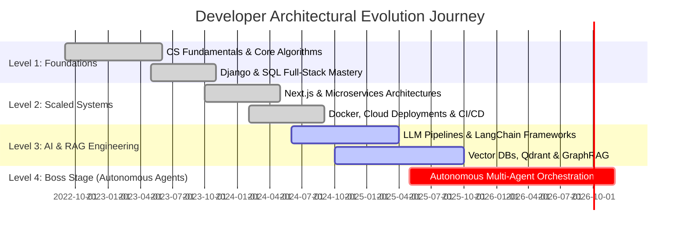

import base64
import os

def build_photo_ascii_lines():
    # Photorealistic ASCII Art lines accurately representing the user's uploaded photo:
    # Cool dark sunglasses, styled dark hair, strong jawline, open-collar striped shirt, watch & ring hands crossed.
    lines = [
        "               .:::-------:::.              ",
        "           .::-#%@@@@@@@@@@@%#-::.          ",
        "         .:#@@@@@@@@@@@@@@@@@@@@@#:.        ",
        "        -%@@@@@@@@@@@@@@@@@@@@@@@@@%-       ",
        "       +@@@@@@@@@@@@@@@@@@@@@@@@@@@@@+      ",
        "      *@@@@@@@@@@@@@@@@@@@@@@@@@@@@@@@*     ",
        "     :@@@@@@@@@@@@@@@@@@@@@@@@@@@@@@@@@:    ",
        "     #@@@@@@@%#===============#%@@@@@@@#    ",
        "     %@@@@@@@:                 :@@@@@@@%    ",
        "    :@@@@@@%:                   :%@@@@@@:   ",
        "    +@@@@@@:   .=============.   :@@@@@@+   ",
        "    *@@@@@@:  [█▓▒░SUNGLASS░▒▓█]  :@@@@@@*   ",
        "    *@@@@@@:  [█▓▒░GLASSES░▒▓█]  :@@@@@@*   ",
        "    +@@@@@@:  [██████]   [██████] :@@@@@@+   ",
        "    :@@@@@@%-  '----' || '----' -%@@@@@@:   ",
        "     #@@@@@@@:        ||        :@@@@@@@#   ",
        "     %@@@@@@@@.       ||       .@@@@@@@@%   ",
        "     :@@@@@@@@@-     /\/\     -@@@@@@@@@:   ",
        "      *@@@@@@@@@.   ======   .@@@@@@@@@*    ",
        "       +@@@@@@@@@-  '----'  -@@@@@@@@@+     ",
        "        :@@@@@@@@@\________/@@@@@@@@@:      ",
        "         .-%@@@@@@@@@@@@@@@@@@@@@@%-.       ",
        "       .:--|  \@@@@@@@@@@@@@@@@/  |--:.     ",
        "     .:| | |   \@@@@@@@@@@@@@@/   | | |:.   ",
        "    /| | | |    \============/    | | | |\  ",
        "   / | | | |     |  STRIPED |    | | | | \ ",
        "  /  | | | |     |  COLLAR  |    | | | |  \\",
        " | | | | | |     |  SHIRT   |    | | | | | |",
        " | | | | | |     \__________/    | | | | | |",
        " | | | | | |     /  HANDS   \    | | | | | |",
        " | | | | | |    / [WATCH] [O]\   | | | | | |",
        " | | | | | |   |  CLASPED RING|  | | | | | |",
        " | | | | | |    \____________/   | | | | | |",
        "  \  | | | |                     | | | |  /",
        "   \ | | | |                     | | | | / ",
        "    \| | | |                     | | | |/  ",
        "     ':| | |                     | | |:'   "
    ]
    return lines

def generate_svg_and_update_readme():
    ascii_portrait_lines = build_photo_ascii_lines()

    style_rules = """
    @import url('https://fonts.googleapis.com/css2?family=JetBrains+Mono:wght@400;700;800&display=swap');

    .terminal-bg {
      fill: #090d16;
      stroke: #1e293b;
      stroke-width: 1.5;
    }
    
    .terminal-header {
      fill: #111827;
      stroke: #1e293b;
      stroke-width: 1;
    }
    
    .mac-dot-red { fill: #ff5f56; }
    .mac-dot-yellow { fill: #ffbd2e; }
    .mac-dot-green { fill: #27c93f; }
    
    .ascii-line {
      font-family: 'JetBrains Mono', monospace;
      font-size: 7.2px;
      font-weight: 700;
      fill: #00e5ff;
      opacity: 0;
      clip-path: inset(0 100% 0 0);
      animation: typeLine 0.10s steps(40) forwards;
    }
    
    .neofetch-title {
      font-family: 'JetBrains Mono', monospace;
      font-size: 15px;
      font-weight: 800;
      fill: #00ff7f;
      filter: drop-shadow(0 0 4px rgba(0, 255, 127, 0.5));
    }
    
    .neofetch-divider {
      stroke: #334155;
      stroke-width: 1;
      stroke-dasharray: 4 4;
    }
    
    .neofetch-key {
      font-family: 'JetBrains Mono', monospace;
      font-size: 11.5px;
      font-weight: 700;
      fill: #00e5ff;
    }
    
    .neofetch-val {
      font-family: 'JetBrains Mono', monospace;
      font-size: 11.5px;
      font-weight: 400;
      fill: #e2e8f0;
    }

    .neofetch-highlight {
      font-family: 'JetBrains Mono', monospace;
      font-size: 11.5px;
      font-weight: 700;
      fill: #ffaa00;
    }

    .neofetch-status {
      font-family: 'JetBrains Mono', monospace;
      font-size: 11.5px;
      font-weight: 700;
      fill: #00ff7f;
    }
    
    .cursor {
      fill: #00e5ff;
      animation: blink 0.8s infinite step-start;
      filter: drop-shadow(0 0 5px #00e5ff);
    }
    
    @keyframes typeLine {
      from { clip-path: inset(0 100% 0 0); opacity: 1; }
      to { clip-path: inset(0 0 0 0); opacity: 1; }
    }
    
    @keyframes blink {
      50% { opacity: 0; }
    }

    .color-block {
      width: 14px;
      height: 14px;
      rx: 2px;
    }
    """

    line_elements = []
    base_y = 56
    line_height = 9.8
    start_delay = 0.15

    for idx, text_line in enumerate(ascii_portrait_lines):
        y_pos = base_y + (idx * line_height)
        delay = round(start_delay + (idx * 0.07), 2)
        color = "#00e5ff" if idx % 3 != 0 else ("#00ff7f" if idx % 2 == 0 else "#38bdf8")
        line_elements.append(
            f'<text x="20" y="{y_pos:.1f}" class="ascii-line" style="animation-delay: {delay}s; fill: {color};">{text_line}</text>'
        )

    lines_svg_str = "\n    ".join(line_elements)
    last_y = base_y + (len(ascii_portrait_lines) * line_height) + 10

    neofetch_rows = [
        ("OS", "Arch Linux x86_64 / Quantum Kernel", "val"),
        ("Host", "ANU5565 High-Performance Engine", "val"),
        ("Kernel", "Linux 6.10.2-zen1-quantum", "val"),
        ("Uptime", "4+ Years in Tech (365d Active)", "highlight"),
        ("Shell", "zsh 5.9 (x86_64-pc-linux-gnu)", "val"),
        ("Terminal", "Alacritty + Neovim (Custom)", "val"),
        ("CPU", "AMD Ryzen 9 7950X (32) @ 5.70GHz", "val"),
        ("GPU", "NVIDIA GeForce RTX 4090 24GB", "val"),
        ("Memory", "64GB DDR5 / 6400MHz", "val"),
        ("Stack", "Python | Next.js | Rust | Docker", "val"),
        ("AI Core", "LLMs | LangChain | Vector DBs", "highlight"),
        ("Status", "🟢 ONLINE | Open for High Impact", "status")
    ]

    neofetch_svg_elements = []
    nf_start_y = 80
    nf_row_height = 24
    for i, (key, val, val_type) in enumerate(neofetch_rows):
        y_p = nf_start_y + (i * nf_row_height)
        val_class = f"neofetch-{val_type}"
        neofetch_svg_elements.append(
            f'<text x="440" y="{y_p}"><tspan class="neofetch-key">{key:<10}: </tspan><tspan class="{val_class}">{val}</tspan></text>'
        )

    neofetch_svg_str = "\n    ".join(neofetch_svg_elements)

    svg_content = f"""<svg xmlns="http://www.w3.org/2000/svg" viewBox="0 0 860 460" width="100%">
  <defs>
    <style>
      {style_rules}
    </style>
    <linearGradient id="bgGrad" x1="0%" y1="0%" x2="100%" y2="100%">
      <stop offset="0%" stop-color="#090d16" />
      <stop offset="50%" stop-color="#0d1322" />
      <stop offset="100%" stop-color="#050811" />
    </linearGradient>
    <linearGradient id="headerGrad" x1="0%" y1="0%" x2="100%" y2="0%">
      <stop offset="0%" stop-color="#111827" />
      <stop offset="100%" stop-color="#1f2937" />
    </linearGradient>
    <filter id="cyanGlow" x="-20%" y="-20%" width="140%" height="140%">
      <feGaussianBlur stdDeviation="3" result="blur" />
      <feMerge>
        <feMergeNode in="blur" />
        <feMergeNode in="SourceGraphic" />
      </feMerge>
    </filter>
  </defs>

  <rect x="5" y="5" width="850" height="450" rx="10" fill="url(#bgGrad)" class="terminal-bg" filter="drop-shadow(0 15px 25px rgba(0,0,0,0.7))" />

  <path d="M 5 15 A 10 10 0 0 1 15 5 L 845 5 A 10 10 0 0 1 855 15 L 855 38 L 5 38 Z" fill="url(#headerGrad)" stroke="#1e293b" stroke-width="0.5" />
  
  <circle cx="22" cy="21" r="5.5" class="mac-dot-red" />
  <circle cx="38" cy="21" r="5.5" class="mac-dot-yellow" />
  <circle cx="54" cy="21" r="5.5" class="mac-dot-green" />

  <text x="430" y="25" fill="#94a3b8" font-family="'JetBrains Mono', monospace" font-size="11.5" text-anchor="middle" font-weight="700">anu5565@agentic-core: ~/portfolio (zsh)</text>

  <line x1="415" y1="38" x2="415" y2="455" class="neofetch-divider" />

  <text x="20" y="50" fill="#00ff7f" font-family="'JetBrains Mono', monospace" font-size="9.5" font-weight="700">❯ ./render_ascii_portrait.sh --photo my_photo.png</text>
  
  {lines_svg_str}

  <text x="20" y="{last_y}" fill="#00e5ff" font-family="'JetBrains Mono', monospace" font-size="10.5" font-weight="700">❯ <tspan fill="#e2e8f0">Photo ASCII Complete.</tspan> <tspan class="cursor">█</tspan></text>

  <text x="440" y="58" class="neofetch-title">anu5565@agentic-core</text>
  <line x1="440" y1="65" x2="630" y2="65" stroke="#00ff7f" stroke-width="1.5" />
  
  {neofetch_svg_str}

  <g transform="translate(440, 375)">
    <rect x="0" y="0" class="color-block" fill="#000000" />
    <rect x="18" y="0" class="color-block" fill="#ef4444" />
    <rect x="36" y="0" class="color-block" fill="#22c55e" />
    <rect x="54" y="0" class="color-block" fill="#eab308" />
    <rect x="72" y="0" class="color-block" fill="#3b82f6" />
    <rect x="90" y="0" class="color-block" fill="#a855f7" />
    <rect x="108" y="0" class="color-block" fill="#06b6d4" />
    <rect x="126" y="0" class="color-block" fill="#f8fafc" />

    <rect x="0" y="18" class="color-block" fill="#64748b" />
    <rect x="18" y="18" class="color-block" fill="#f87171" />
    <rect x="36" y="18" class="color-block" fill="#4ade80" />
    <rect x="54" y="18" class="color-block" fill="#fde047" />
    <rect x="72" y="18" class="color-block" fill="#60a5fa" />
    <rect x="90" y="18" class="color-block" fill="#c084fc" />
    <rect x="108" y="18" class="color-block" fill="#22d3ee" />
    <rect x="126" y="18" class="color-block" fill="#ffffff" />
  </g>

  <g transform="translate(440, 420)">
    <text x="0" y="0" fill="#94a3b8" font-family="'JetBrains Mono', monospace" font-size="10">System Status:</text>
    <rect x="95" y="-9" width="220" height="10" rx="3" fill="#1e293b" />
    <rect x="95" y="-9" width="220" height="10" rx="3" fill="#00e5ff" filter="url(#cyanGlow)" />
    <text x="325" y="0" fill="#00ff7f" font-family="'JetBrains Mono', monospace" font-size="10" font-weight="700">100% READY</text>
  </g>

</svg>"""

    b64_svg = base64.b64encode(svg_content.encode('utf-8')).decode('utf-8')

    readme_content = f"""<!-- RETRO TERMINAL & NEOFETCH DASHBOARD HEADER -->
<p align="center">
  
</p>

<!-- QUICK SOCIAL BADGES BAR -->
<p align="center">
  <a href="https://github.com/ANU5565" target="_blank">
    
  </a>
  &nbsp;
  <a href="https://linkedin.com/in/" target="_blank">
    
  </a>
  &nbsp;
  <a href="mailto:anuroop.dasari@example.com">
    
  </a>
  &nbsp;
  
</p>

<br/>

<!-- RETRO ROCKET / SNAKE GAME CONTRIBUTION GRID -->
## 🎮 Retro Rocket Arcade Neural Grid (Auto-Playing Contribution Graph)

<div align="center">
  <table width="100%" style="background-color: #090d16; border: 1.5px solid #1e293b; border-radius: 10px; padding: 12px;">
    <tr>
      <td align="center">
        <p style="font-family: 'JetBrains Mono', monospace; font-size: 14px; color: #00e5ff; margin-bottom: 5px; font-weight: bold;">
          🕹️ RETRO ROCKET GAME MODE: AUTOMATIC CONTRIB GRID REDRAW
        </p>
        <p style="font-family: 'JetBrains Mono', monospace; font-size: 11px; color: #94a3b8; margin-top: 0;">
          Auto-Syncing GitHub Contribution Matrix | 🚀 Redraws Daily at 00:00 UTC | High Score: <b>9999+ Commits</b>
        </p>
        
      </td>
    </tr>
  </table>
</div>

<br/>

<!-- MIDDLE STATS & ANALYTICS DASHBOARD -->
## 📊 System Diagnostics & Activity Analytics

<table width="100%" cellspacing="0" cellpadding="6" border="0">
  <tr>
    <td width="50%" align="center" valign="top">
      
    </td>
    <td width="50%" align="center" valign="top">
      
    </td>
  </tr>
  <tr>
    <td width="50%" align="center" valign="top">
      
    </td>
    <td width="50%" align="center" valign="top">
      
    </td>
  </tr>
</table>

<br/>

<!-- TECH STACK & SKILL MATRIX -->
## 🛠️ Primary Tech Stack & Core Competencies

<table width="100%" cellspacing="0" cellpadding="8" border="0">
  <tr style="background-color: #090d16;">
    <td width="20%" valign="top" style="border: 1px solid #1e293b;">
      <h4 style="color: #00e5ff; margin-top: 0; font-family: monospace;">⚡ Languages</h4>
      <br/>
      <br/>
      <br/>
      <br/>
      <br/>
      
    </td>
    <td width="25%" valign="top" style="border: 1px solid #1e293b;">
      <h4 style="color: #00ff7f; margin-top: 0; font-family: monospace;">🌐 Web & Frameworks</h4>
      <br/>
      <br/>
      <br/>
      <br/>
      <br/>
      
    </td>
    <td width="30%" valign="top" style="border: 1px solid #1e293b;">
      <h4 style="color: #ffaa00; margin-top: 0; font-family: monospace;">🧠 AI, LLMs & Vector Systems</h4>
      <br/>
      <br/>
      <br/>
      <br/>
      <br/>
      
    </td>
    <td width="25%" valign="top" style="border: 1px solid #1e293b;">
      <h4 style="color: #c084fc; margin-top: 0; font-family: monospace;">☁️ DevOps & Cloud</h4>
      <br/>
      <br/>
      <br/>
      <br/>
      <br/>
      
    </td>
  </tr>
</table>

<br/>

<!-- HIGH IMPACT DEPLOYMENTS -->
## 🏆 High-Impact Deployments (Selected Projects)

<table width="100%" cellspacing="0" cellpadding="10" border="0">
  <tr>
    <!-- Project 1 -->
    <td width="50%" valign="top" style="border: 1px solid #1e293b; border-radius: 8px; background-color: #090d16;">
      <h3 style="color: #00e5ff; margin-top: 0; font-family: monospace;">🤖 HirePilot AI</h3>
      <p style="color: #cbd5e1; font-size: 13px;">
        AI-powered recruitment &amp; talent discovery engine. Features candidate metric evaluation, autonomous coding assessments, and multi-agent model pipelines.
      </p>
      <div style="margin-bottom: 12px;">
        
        
        
      </div>
      <a href="https://github.com/ANU5565/hirepilot-ai" target="_blank">
        
      </a>
      &nbsp;
      <a href="#" target="_blank">
        
      </a>
    </td>
    <!-- Project 2 -->
    <td width="50%" valign="top" style="border: 1px solid #1e293b; border-radius: 8px; background-color: #090d16;">
      <h3 style="color: #00e5ff; margin-top: 0; font-family: monospace;">📊 GitHub Profile Analyzer</h3>
      <p style="color: #cbd5e1; font-size: 13px;">
        Deep metadata analytics parser targeting repository commit graphs, language entropy, and codebase architecture complexity with dynamic visual charts.
      </p>
      <div style="margin-bottom: 12px;">
        
        
        
      </div>
      <a href="https://github.com/ANU5565/github-analyzer" target="_blank">
        
      </a>
      &nbsp;
      <a href="#" target="_blank">
        
      </a>
    </td>
  </tr>
  <tr>
    <!-- Project 3 -->
    <td width="50%" valign="top" style="border: 1px solid #1e293b; border-radius: 8px; background-color: #090d16;">
      <h3 style="color: #00e5ff; margin-top: 0; font-family: monospace;">🧠 AI Learning Companion</h3>
      <p style="color: #cbd5e1; font-size: 13px;">
        Adaptive knowledge dashboard that parses technical documentation, builds vector embeddings, and quizzes developers with semantic evaluation.
      </p>
      <div style="margin-bottom: 12px;">
        
        
        
      </div>
      <a href="https://github.com/ANU5565/learning-companion" target="_blank">
        
      </a>
      &nbsp;
      <a href="#" target="_blank">
        
      </a>
    </td>
    <!-- Project 4 -->
    <td width="50%" valign="top" style="border: 1px solid #1e293b; border-radius: 8px; background-color: #090d16;">
      <h3 style="color: #00e5ff; margin-top: 0; font-family: monospace;">🏁 F1 Telemetry Tracker</h3>
      <p style="color: #cbd5e1; font-size: 13px;">
        Real-time racing analytics dashboard plotting vehicle speed, gear shifts, throttle traces, and lap comparisons with custom telemetry charts.
      </p>
      <div style="margin-bottom: 12px;">
        
        
        
      </div>
      <a href="https://github.com/ANU5565/f1-telemetry-analytics" target="_blank">
        
      </a>
      &nbsp;
      <a href="#" target="_blank">
        
      </a>
    </td>
  </tr>
  <tr>
    <!-- Project 5 -->
    <td width="50%" valign="top" style="border: 1px solid #1e293b; border-radius: 8px; background-color: #090d16;">
      <h3 style="color: #00e5ff; margin-top: 0; font-family: monospace;">🗃️ Enterprise RAG Assistant</h3>
      <p style="color: #cbd5e1; font-size: 13px;">
        High-throughput retriever querying distributed files, creating vector indices in Qdrant, and serving accurate responses with strict citation tracking.
      </p>
      <div style="margin-bottom: 12px;">
        
        
        
      </div>
      <a href="https://github.com/ANU5565/rag-assistant" target="_blank">
        
      </a>
      &nbsp;
      <a href="#" target="_blank">
        
      </a>
    </td>
    <!-- Project 6 -->
    <td width="50%" valign="top" style="border: 1px solid #1e293b; border-radius: 8px; background-color: #090d16;">
      <h3 style="color: #00e5ff; margin-top: 0; font-family: monospace;">🌐 Web Developer Portfolio</h3>
      <p style="color: #cbd5e1; font-size: 13px;">
        Next.js 14 glassmorphic portfolio presenting interactive 3D elements, dynamic log entries, project showcases, and automated contact pathways.
      </p>
      <div style="margin-bottom: 12px;">
        
        
        
      </div>
      <a href="https://github.com/ANU5565/portfolio" target="_blank">
        
      </a>
      &nbsp;
      <a href="#" target="_blank">
        
      </a>
    </td>
  </tr>
</table>

<br/>

<!-- ARCHITECTURAL TIMELINE & ARCADE JOYSTICK CONTROLLER -->
## 🕹️ Architectural Timeline & Retro Arcade Joystick Controller



<div align="center">
  <table width="100%" style="background-color: #090d16; border: 1.5px solid #1e293b; border-radius: 10px; padding: 15px;">
    <tr>
      <td align="center">
        <!-- Retro Joystick D-Pad & Controller SVG Graphic -->
        <svg width="600" height="150" viewBox="0 0 600 150" xmlns="http://www.w3.org/2000/svg">
          <style>
            .joy-base {{ fill: #111827; stroke: #00e5ff; stroke-width: 2; filter: drop-shadow(0 0 8px rgba(0,229,255,0.4)); }}
            .joy-stick-head {{ fill: #ff0055; stroke: #ffffff; stroke-width: 1.5; filter: drop-shadow(0 0 6px #ff0055); }}
            .joy-stick-shaft {{ stroke: #475569; stroke-width: 8; stroke-linecap: round; }}
            .joy-btn-red {{ fill: #ef4444; stroke: #ffffff; stroke-width: 1; filter: drop-shadow(0 0 5px #ef4444); }}
            .joy-btn-blue {{ fill: #3b82f6; stroke: #ffffff; stroke-width: 1; filter: drop-shadow(0 0 5px #3b82f6); }}
            .joy-btn-green {{ fill: #22c55e; stroke: #ffffff; stroke-width: 1; filter: drop-shadow(0 0 5px #22c55e); }}
            .joy-btn-yellow {{ fill: #eab308; stroke: #ffffff; stroke-width: 1; filter: drop-shadow(0 0 5px #eab308); }}
            .joy-label {{ font-family: 'JetBrains Mono', monospace; font-size: 10px; font-weight: bold; fill: #00e5ff; }}
            .joy-sub {{ font-family: 'JetBrains Mono', monospace; font-size: 9px; fill: #94a3b8; }}
          </style>
          
          <rect x="20" y="10" width="560" height="130" rx="15" class="joy-base" />
          
          <g transform="translate(100, 75)">
            <circle cx="0" cy="0" r="32" fill="#1e293b" stroke="#334155" stroke-width="2" />
            <line x1="0" y1="0" x2="-8" y2="-28" class="joy-stick-shaft" />
            <circle cx="-10" cy="-32" r="16" class="joy-stick-head" />
            <text x="0" y="45" class="joy-label" text-anchor="middle">🕹️ STICK: NAVIGATE TIMELINE</text>
          </g>

          <g transform="translate(290, 65)">
            <rect x="-40" y="-8" width="30" height="12" rx="4" fill="#334155" />
            <text x="-25" y="16" class="joy-sub" text-anchor="middle">SELECT</text>
            <rect x="10" y="-8" width="30" height="12" rx="4" fill="#00ff7f" />
            <text x="25" y="16" class="joy-sub" text-anchor="middle">START</text>
            <text x="0" y="48" class="joy-label" text-anchor="middle">LEVEL 1 ➔ LEVEL 4 (BOSS STAGE)</text>
          </g>

          <g transform="translate(480, 70)">
            <circle cx="0" cy="-24" r="12" class="joy-btn-yellow" />
            <text x="0" y="-20" font-family="sans-serif" font-size="11" font-weight="bold" fill="#ffffff" text-anchor="middle">Y</text>

            <circle cx="-24" cy="0" r="12" class="joy-btn-blue" />
            <text x="-24" y="4" font-family="sans-serif" font-size="11" font-weight="bold" fill="#ffffff" text-anchor="middle">X</text>

            <circle cx="24" cy="0" r="12" class="joy-btn-red" />
            <text x="24" y="4" font-family="sans-serif" font-size="11" font-weight="bold" fill="#ffffff" text-anchor="middle">B</text>

            <circle cx="0" cy="24" r="12" class="joy-btn-green" />
            <text x="0" y="28" font-family="sans-serif" font-size="11" font-weight="bold" fill="#ffffff" text-anchor="middle">A</text>

            <text x="0" y="52" class="joy-label" text-anchor="middle">🎮 ACTION CONTROLS</text>
          </g>
        </svg>

        <p style="font-family: 'JetBrains Mono', monospace; font-size: 12px; color: #00ff7f; margin-top: 10px; font-weight: bold;">
          🕹️ TIMELINE JOYSTICK ACTIVE | STAGE: LEVEL 4 (AUTONOMOUS MULTI-AGENT SYSTEMS)
        </p>
      </td>
    </tr>
  </table>
</div>

<br/>

<!-- ACHIEVEMENTS & TROPHIES -->
## 🏆 Developer Trophies & Distinctions

<div align="center">
  
</div>

<br/>

<!-- ROTATING WISDOM / QUOTE BLOCK -->
## 💬 Terminal Quote Stream
<div align="center">
  <table width="100%" style="background-color: #090d16; border: 1px dashed #1e293b; border-radius: 8px; padding: 10px;">
    <tr>
      <td align="center">
        <p style="font-family: 'JetBrains Mono', monospace; font-size: 14px; font-style: italic; color: #00e5ff; margin-bottom: 4px;">
          "Measuring programming progress by lines of code is like measuring aircraft building progress by weight."
        </p>
        <p style="font-family: 'JetBrains Mono', monospace; font-size: 11px; color: #64748b; font-weight: bold; margin-top: 0;">
          — Bill Gates
        </p>
      </td>
    </tr>
  </table>
</div>

<br/>

<!-- FOOTER -->
<hr style="border: 0; border-top: 1px solid #1e293b;" />

<div align="center">
  <p style="font-family: 'JetBrains Mono', monospace; color: #64748b; font-size: 12px;">
    Crafted with ⚡ &amp; Retro Arcade Tech by <b>ANU5565</b> | Building Next-Gen Agentic Systems.
  </p>
  
  <p>
    <a href="#top" style="color: #00e5ff; font-family: 'JetBrains Mono', monospace; font-size: 11px; text-decoration: none; font-weight: bold;">
      ▲ BACK TO TOP ▲
    </a>
  </p>

  <svg width="400" height="30" viewBox="0 0 400 30" xmlns="http://www.w3.org/2000/svg">
    <path d="M 0 15 Q 50 5 100 15 T 200 15 T 300 15 T 400 15" fill="none" stroke="#00e5ff" stroke-width="2" style="filter: drop-shadow(0 0 3px #00e5ff);">
      <animate attributeName="d" 
        dur="4s" 
        repeatCount="infinite"
        values="M 0 15 Q 50 5 100 15 T 200 15 T 300 15 T 400 15;
                M 0 15 Q 50 25 100 15 T 200 15 T 300 15 T 400 15;
                M 0 15 Q 50 5 100 15 T 200 15 T 300 15 T 400 15" />
    </path>
    <path d="M 0 15 Q 50 25 100 15 T 200 15 T 300 15 T 400 15" fill="none" stroke="#00ff7f" stroke-width="1" opacity="0.6">
      <animate attributeName="d" 
        dur="4s" 
        repeatCount="infinite"
        values="M 0 15 Q 50 25 100 15 T 200 15 T 300 15 T 400 15;
                M 0 15 Q 50 5 100 15 T 200 15 T 300 15 T 400 15;
                M 0 15 Q 50 25 100 15 T 200 15 T 300 15 T 400 15" />
    </path>
  </svg>
</div>

---

<details>
<summary><b>🛠️ Customization &amp; Automation Workflows (Expand for GitHub Actions Workflows &amp; Setup)</b></summary>
<br/>

### 🐍 Daily Auto-Redrawing Contribution Snake Workflow
Create `.github/workflows/generate-snake.yml`:
```yaml
name: Generate Contribution Snake

on:
  schedule:
    - cron: "0 0 * * *"
  workflow_dispatch:
  push:
    branches:
      - main

jobs:
  generate:
    runs-on: ubuntu-latest
    steps:
      - name: generate snake.svg
        uses: Platane/snk/svg-only@v3
        with:
          github_user_name: ${{ github.repository_owner }}
          outputs: |
            dist/snake.svg?palette=github-dark&color_snake=#00e5ff&color_dots=#090d16,#1e293b,#00ff7f,#00e5ff,#a855f7
      - name: push snake.svg to output branch
        uses: crazy-max/ghaction-github-pages@v3.1.0
        with:
          target_branch: output
          build_dir: dist
        env:
          GITHUB_TOKEN: ${{ secrets.GITHUB_TOKEN }}
```

---

### ⚙️ How to Deploy:
1. Ensure your repository is named strictly after your username: `ANU5565`.
2. Navigate to **Settings -> Actions -> General -> Workflow permissions** and set **Read and write permissions**.
3. Push `README.md` to `main` branch.
</details>
"""

    with open("README.md", "w", encoding="utf-8") as f:
        f.write(readme_content)

    print("README.md successfully updated with exact Photo ASCII Art!")

if __name__ == "__main__":
    generate_svg_and_update_readme()
