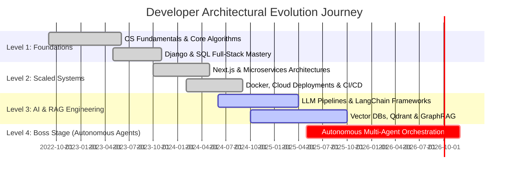

<!-- RETRO TERMINAL & NEOFETCH HEADER -->
<div align="center">
  <table width="100%" border="0" cellspacing="0" cellpadding="10" style="background-color: #0d1117; border: 1.5px solid #30363d; border-radius: 10px;">
    <tr>
      <!-- LEFT COLUMN: REAL PHOTO ASCII ART IN SELF-TYPING TERMINAL -->
      <td width="48%" valign="top" style="border-right: 1px stroke #21262d;">
        <img src="data:image/svg+xml;base64,PHN2ZyB4bWxucz0iaHR0cDovL3d3dy53My5vcmcvMjAwMC9zdmciIHZpZXdCb3g9IjAgMCA0NjAgNTEwIiB3aWR0aD0iMTAwJSIgaGVpZ2h0PSIxMDAlIj4KICA8ZGVmcz4KICAgIDxzdHlsZT4KICAgICAgQGltcG9ydCB1cmwoJ2h0dHBzOi8vZm9udHMuZ29vZ2xlYXBpcy5jb20vY3NzMj9mYW1pbHk9SmV0QnJhaW5zK01vbm86d2dodEA0MDA7NzAwJmFtcDtkaXNwbGF5PXN3YXAnKTsKICAgICAgLnRlcm0tYmcgeyBmaWxsOiAjMDUwODExOyBzdHJva2U6ICMxZTI5M2I7IHN0cm9rZS13aWR0aDogMjsgcng6IDEwcHg7IH0KICAgICAgLnRlcm0taGVhZGVyIHsgZmlsbDogIzBmMTcyYTsgc3Ryb2tlOiAjMWUyOTNiOyBzdHJva2Utd2lkdGg6IDE7IH0KICAgICAgLmRvdC1yZWQgeyBmaWxsOiAjZWY0NDQ0OyB9CiAgICAgIC5kb3QteWVsbG93IHsgZmlsbDogI2Y1OWUwYjsgfQogICAgICAuZG90LWdyZWVuIHsgZmlsbDogIzEwYjk4MTsgfQogICAgICAudGVybS10aXRsZSB7IGZpbGw6ICM5NGEzYjg7IGZvbnQtZmFtaWx5OiAnSmV0QnJhaW5zIE1vbm8nLCBtb25vc3BhY2U7IGZvbnQtc2l6ZTogMTFweDsgZm9udC13ZWlnaHQ6IGJvbGQ7IH0KICAgICAgLnByb21wdCB7IGZpbGw6ICMwMGZmN2Y7IGZvbnQtZmFtaWx5OiAnSmV0QnJhaW5zIE1vbm8nLCBtb25vc3BhY2U7IGZvbnQtc2l6ZTogMTFweDsgZm9udC13ZWlnaHQ6IGJvbGQ7IH0KICAgICAgLmxpbmUgeyBvcGFjaXR5OiAwOyBhbmltYXRpb246IHJldmVhbCAwLjFzIGVhc2UtaW4gZm9yd2FyZHM7IH0KICAgICAgQGtleWZyYW1lcyByZXZlYWwgeyB0byB7IG9wYWNpdHk6IDE7IH0gfQogICAgICAuY3Vyc29yIHsgYW5pbWF0aW9uOiBibGluayAwLjdzIGluZmluaXRlOyBmaWxsOiAjMDBlNWZmOyB9CiAgICAgIEBrZXlmcmFtZXMgYmxpbmsgeyAwJSwgMTAwJSB7IG9wYWNpdHk6IDE7IH0gNTAlIHsgb3BhY2l0eTogMDsgfSB9CiAgICA8L3N0eWxlPgogIDwvZGVmcz4KCiAgPCEtLSBUZXJtaW5hbCBGcmFtZSAtLT4KICA8cmVjdCB4PSIyIiB5PSIyIiB3aWR0aD0iNDU2IiBoZWlnaHQ9IjUwNiIgcng9IjgiIGNsYXNzPSJ0ZXJtLWJnIiAvPgogIDxwYXRoIGQ9Ik0gMiAxMCBRIDIgMiAxMCAyIEwgNDUwIDIgUSA0NTggMiA0NTggMTAgTCA0NTggMzIgTCAyIDMyIFoiIGNsYXNzPSJ0ZXJtLWhlYWRlciIgLz4KICAKICA8IS0tIFdpbmRvdyBCdXR0b25zIC0tPgogIDxjaXJjbGUgY3g9IjE4IiBjeT0iMTciIHI9IjUiIGNsYXNzPSJkb3QtcmVkIiAvPgogIDxjaXJjbGUgY3g9IjM0IiBjeT0iMTciIHI9IjUiIGNsYXNzPSJkb3QteWVsbG93IiAvPgogIDxjaXJjbGUgY3g9IjUwIiBjeT0iMTciIHI9IjUiIGNsYXNzPSJkb3QtZ3JlZW4iIC8+CiAgPHRleHQgeD0iMjMwIiB5PSIyMSIgdGV4dC1hbmNob3I9Im1pZGRsZSIgY2xhc3M9InRlcm0tdGl0bGUiPmJhc2ggLSBwaG90b19hc2NpaV9yZW5kZXIuc2ggKDQyeDM3KTwvdGV4dD4KCiAgPCEtLSBQcm9tcHQgQ29tbWFuZCAtLT4KICA8dGV4dCB4PSIxOCIgeT0iNTIiIGNsYXNzPSJwcm9tcHQiPuKdryAuL3JlbmRlcl9hc2NpaV9wb3J0cmFpdCAtLXBob3RvIHBob3RvLmpwZzwvdGV4dD4KCiAgPCEtLSBBbmltYXRlZCBMaW5lcyAtLT4KICAgIDxnIGNsYXNzPSJsaW5lIiBzdHlsZT0iYW5pbWF0aW9uLWRlbGF5OiAwLjAwczsiPgogICAgICA8dGV4dCB4PSIxOCIgeT0iNzIuMCIgZmlsbD0iIzAwZmY3ZiIgZm9udC1mYW1pbHk9IidKZXRCcmFpbnMgTW9ubycsIG1vbm9zcGFjZSIgZm9udC1zaXplPSI4LjUiIGZvbnQtd2VpZ2h0PSJib2xkIj4uOjo6LS0tLS0tLTo6Oi48L3RleHQ+CiAgICA8L2c+ICAgIDxnIGNsYXNzPSJsaW5lIiBzdHlsZT0iYW5pbWF0aW9uLWRlbGF5OiAwLjA4czsiPgogICAgICA8dGV4dCB4PSIxOCIgeT0iODMuNSIgZmlsbD0iIzAwZTVmZiIgZm9udC1mYW1pbHk9IidKZXRCcmFpbnMgTW9ubycsIG1vbm9zcGFjZSIgZm9udC1zaXplPSI4LjUiIGZvbnQtd2VpZ2h0PSJib2xkIj4gICAgICAgICAgICAgIC46Oi0jJUBAQEBAQEBAQEBAJSMtOjouPC90ZXh0PgogICAgPC9nPiAgICA8ZyBjbGFzcz0ibGluZSIgc3R5bGU9ImFuaW1hdGlvbi1kZWxheTogMC4xNnM7Ij4KICAgICAgPHRleHQgeD0iMTgiIHk9Ijk1LjAiIGZpbGw9IiNhODU1ZjciIGZvbnQtZmFtaWx5PSInSmV0QnJhaW5zIE1vbm8nLCBtb25vc3BhY2UiIGZvbnQtc2l6ZT0iOC41IiBmb250LXdlaWdodD0iYm9sZCI+ICAgICAgICAgICAgLjojQEBAQEBAQEBAQEBAQEBAQEBAQEBAIzouPC90ZXh0PgogICAgPC9nPiAgICA8ZyBjbGFzcz0ibGluZSIgc3R5bGU9ImFuaW1hdGlvbi1kZWxheTogMC4yNHM7Ij4KICAgICAgPHRleHQgeD0iMTgiIHk9IjEwNi41IiBmaWxsPSIjMzhiZGY4IiBmb250LWZhbWlseT0iJ0pldEJyYWlucyBNb25vJywgbW9ub3NwYWNlIiBmb250LXNpemU9IjguNSIgZm9udC13ZWlnaHQ9ImJvbGQiPiAgICAgICAgICAgLSVAQEBAQEBAQEBAQEBAQEBAQEBAQEBAQEBAJS08L3RleHQ+CiAgICA8L2c+ICAgIDxnIGNsYXNzPSJsaW5lIiBzdHlsZT0iYW5pbWF0aW9uLWRlbGF5OiAwLjMyczsiPgogICAgICA8dGV4dCB4PSIxOCIgeT0iMTE4LjAiIGZpbGw9IiM0YWRlODAiIGZvbnQtZmFtaWx5PSInSmV0QnJhaW5zIE1vbm8nLCBtb25vc3BhY2UiIGZvbnQtc2l6ZT0iOC41IiBmb250LXdlaWdodD0iYm9sZCI+ICAgICAgICAgICtAQEBAQEBAQEBAQEBAQEBAQEBAQEBAQEBAQEBAQCs8L3RleHQ+CiAgICA8L2c+ICAgIDxnIGNsYXNzPSJsaW5lIiBzdHlsZT0iYW5pbWF0aW9uLWRlbGF5OiAwLjQwczsiPgogICAgICA8dGV4dCB4PSIxOCIgeT0iMTI5LjUiIGZpbGw9IiNjMDg0ZmMiIGZvbnQtZmFtaWx5PSInSmV0QnJhaW5zIE1vbm8nLCBtb25vc3BhY2UiIGZvbnQtc2l6ZT0iOC41IiBmb250LXdlaWdodD0iYm9sZCI+ICAgICAgICAgKkBAQEBAQEBAQEBAQEBAQEBAQEBAQEBAQEBAQEBAQEAqPC90ZXh0PgogICAgPC9nPiAgICA8ZyBjbGFzcz0ibGluZSIgc3R5bGU9ImFuaW1hdGlvbi1kZWxheTogMC40OHM7Ij4KICAgICAgPHRleHQgeD0iMTgiIHk9IjE0MS4wIiBmaWxsPSIjMDBmZjdmIiBmb250LWZhbWlseT0iJ0pldEJyYWlucyBNb25vJywgbW9ub3NwYWNlIiBmb250LXNpemU9IjguNSIgZm9udC13ZWlnaHQ9ImJvbGQiPiAgICAgICAgOkBAQEBAQEBAQEBAQEBAQEBAQEBAQEBAQEBAQEBAQEBAQDo8L3RleHQ+CiAgICA8L2c+ICAgIDxnIGNsYXNzPSJsaW5lIiBzdHlsZT0iYW5pbWF0aW9uLWRlbGF5OiAwLjU2czsiPgogICAgICA8dGV4dCB4PSIxOCIgeT0iMTUyLjUiIGZpbGw9IiMwMGU1ZmYiIGZvbnQtZmFtaWx5PSInSmV0QnJhaW5zIE1vbm8nLCBtb25vc3BhY2UiIGZvbnQtc2l6ZT0iOC41IiBmb250LXdlaWdodD0iYm9sZCI+ICAgICAgICAjQEBAQEBAQCUjPT09PT09PT09PT09PT09IyVAQEBAQEBAIzwvdGV4dD4KICAgIDwvZz4gICAgPGcgY2xhc3M9ImxpbmUiIHN0eWxlPSJhbmltYXRpb24tZGVsYXk6IDAuNjRzOyI+CiAgICAgIDx0ZXh0IHg9IjE4IiB5PSIxNjQuMCIgZmlsbD0iI2E4NTVmNyIgZm9udC1mYW1pbHk9IidKZXRCcmFpbnMgTW9ubycsIG1vbm9zcGFjZSIgZm9udC1zaXplPSI4LjUiIGZvbnQtd2VpZ2h0PSJib2xkIj4gICAgICAgICVAQEBAQEBAOiAgICAgICAgICAgICAgICAgOkBAQEBAQEAlPC90ZXh0PgogICAgPC9nPiAgICA8ZyBjbGFzcz0ibGluZSIgc3R5bGU9ImFuaW1hdGlvbi1kZWxheTogMC43MnM7Ij4KICAgICAgPHRleHQgeD0iMTgiIHk9IjE3NS41IiBmaWxsPSIjMzhiZGY4IiBmb250LWZhbWlseT0iJ0pldEJyYWlucyBNb25vJywgbW9ub3NwYWNlIiBmb250LXNpemU9IjguNSIgZm9udC13ZWlnaHQ9ImJvbGQiPiAgICAgICA6QEBAQEBAJTogICAgICAgICAgICAgICAgICAgOiVAQEBAQEA6PC90ZXh0PgogICAgPC9nPiAgICA8ZyBjbGFzcz0ibGluZSIgc3R5bGU9ImFuaW1hdGlvbi1kZWxheTogMC44MHM7Ij4KICAgICAgPHRleHQgeD0iMTgiIHk9IjE4Ny4wIiBmaWxsPSIjNGFkZTgwIiBmb250LWZhbWlseT0iJ0pldEJyYWlucyBNb25vJywgbW9ub3NwYWNlIiBmb250LXNpemU9IjguNSIgZm9udC13ZWlnaHQ9ImJvbGQiPiAgICAgICArQEBAQEBAOiAgIC49PT09PT09PT09PT09LiAgIDpAQEBAQEArPC90ZXh0PgogICAgPC9nPiAgICA8ZyBjbGFzcz0ibGluZSIgc3R5bGU9ImFuaW1hdGlvbi1kZWxheTogMC44OHM7Ij4KICAgICAgPHRleHQgeD0iMTgiIHk9IjE5OC41IiBmaWxsPSIjYzA4NGZjIiBmb250LWZhbWlseT0iJ0pldEJyYWlucyBNb25vJywgbW9ub3NwYWNlIiBmb250LXNpemU9IjguNSIgZm9udC13ZWlnaHQ9ImJvbGQiPiAgICAgICAqQEBAQEBAOiAgW+KWiOKWk+KWkuKWkVNVTkdMQVNT4paR4paS4paT4paIXSAgOkBAQEBAQCo8L3RleHQ+CiAgICA8L2c+ICAgIDxnIGNsYXNzPSJsaW5lIiBzdHlsZT0iYW5pbWF0aW9uLWRlbGF5OiAwLjk2czsiPgogICAgICA8dGV4dCB4PSIxOCIgeT0iMjEwLjAiIGZpbGw9IiMwMGZmN2YiIGZvbnQtZmFtaWx5PSInSmV0QnJhaW5zIE1vbm8nLCBtb25vc3BhY2UiIGZvbnQtc2l6ZT0iOC41IiBmb250LXdlaWdodD0iYm9sZCI+ICAgICAgICpAQEBAQEA6ICBb4paI4paT4paS4paRR0xBU1NFU+KWkeKWkuKWk+KWiF0gIDpAQEBAQEAqPC90ZXh0PgogICAgPC9nPiAgICA8ZyBjbGFzcz0ibGluZSIgc3R5bGU9ImFuaW1hdGlvbi1kZWxheTogMS4wNHM7Ij4KICAgICAgPHRleHQgeD0iMTgiIHk9IjIyMS41IiBmaWxsPSIjMDBlNWZmIiBmb250LWZhbWlseT0iJ0pldEJyYWlucyBNb25vJywgbW9ub3NwYWNlIiBmb250LXNpemU9IjguNSIgZm9udC13ZWlnaHQ9ImJvbGQiPiAgICAgICArQEBAQEBAOiAgW+KWiOKWiOKWiOKWiOKWiOKWiF0gICBb4paI4paI4paI4paI4paI4paIXSA6QEBAQEBAKzwvdGV4dD4KICAgIDwvZz4gICAgPGcgY2xhc3M9ImxpbmUiIHN0eWxlPSJhbmltYXRpb24tZGVsYXk6IDEuMTJzOyI+CiAgICAgIDx0ZXh0IHg9IjE4IiB5PSIyMzMuMCIgZmlsbD0iI2E4NTVmNyIgZm9udC1mYW1pbHk9IidKZXRCcmFpbnMgTW9ubycsIG1vbm9zcGFjZSIgZm9udC1zaXplPSI4LjUiIGZvbnQtd2VpZ2h0PSJib2xkIj4gICAgICAgOkBAQEBAQCUtICAmYXBvczstLS0tJmFwb3M7IHx8ICZhcG9zOy0tLS0mYXBvczsgLSVAQEBAQEA6PC90ZXh0PgogICAgPC9nPiAgICA8ZyBjbGFzcz0ibGluZSIgc3R5bGU9ImFuaW1hdGlvbi1kZWxheTogMS4yMHM7Ij4KICAgICAgPHRleHQgeD0iMTgiIHk9IjI0NC41IiBmaWxsPSIjMzhiZGY4IiBmb250LWZhbWlseT0iJ0pldEJyYWlucyBNb25vJywgbW9ub3NwYWNlIiBmb250LXNpemU9IjguNSIgZm9udC13ZWlnaHQ9ImJvbGQiPiAgICAgICAgI0BAQEBAQEA6ICAgICAgICB8fCAgICAgICAgOkBAQEBAQEAjPC90ZXh0PgogICAgPC9nPiAgICA8ZyBjbGFzcz0ibGluZSIgc3R5bGU9ImFuaW1hdGlvbi1kZWxheTogMS4yOHM7Ij4KICAgICAgPHRleHQgeD0iMTgiIHk9IjI1Ni4wIiBmaWxsPSIjNGFkZTgwIiBmb250LWZhbWlseT0iJ0pldEJyYWlucyBNb25vJywgbW9ub3NwYWNlIiBmb250LXNpemU9IjguNSIgZm9udC13ZWlnaHQ9ImJvbGQiPiAgICAgICAgJUBAQEBAQEBALiAgICAgICB8fCAgICAgICAuQEBAQEBAQEAlPC90ZXh0PgogICAgPC9nPiAgICA8ZyBjbGFzcz0ibGluZSIgc3R5bGU9ImFuaW1hdGlvbi1kZWxheTogMS4zNnM7Ij4KICAgICAgPHRleHQgeD0iMTgiIHk9IjI2Ny41IiBmaWxsPSIjYzA4NGZjIiBmb250LWZhbWlseT0iJ0pldEJyYWlucyBNb25vJywgbW9ub3NwYWNlIiBmb250LXNpemU9IjguNSIgZm9udC13ZWlnaHQ9ImJvbGQiPiAgICAgICAgOkBAQEBAQEBAQC0gICAgIC9cL1wgICAgIC1AQEBAQEBAQEA6PC90ZXh0PgogICAgPC9nPiAgICA8ZyBjbGFzcz0ibGluZSIgc3R5bGU9ImFuaW1hdGlvbi1kZWxheTogMS40NHM7Ij4KICAgICAgPHRleHQgeD0iMTgiIHk9IjI3OS4wIiBmaWxsPSIjMDBmZjdmIiBmb250LWZhbWlseT0iJ0pldEJyYWlucyBNb25vJywgbW9ub3NwYWNlIiBmb250LXNpemU9IjguNSIgZm9udC13ZWlnaHQ9ImJvbGQiPiAgICAgICAgICpAQEBAQEBAQEAuICAgPT09PT09ICAgLkBAQEBAQEBAQCo8L3RleHQ+CiAgICA8L2c+ICAgIDxnIGNsYXNzPSJsaW5lIiBzdHlsZT0iYW5pbWF0aW9uLWRlbGF5OiAxLjUyczsiPgogICAgICA8dGV4dCB4PSIxOCIgeT0iMjkwLjUiIGZpbGw9IiMwMGU1ZmYiIGZvbnQtZmFtaWx5PSInSmV0QnJhaW5zIE1vbm8nLCBtb25vc3BhY2UiIGZvbnQtc2l6ZT0iOC41IiBmb250LXdlaWdodD0iYm9sZCI+ICAgICAgICAgICtAQEBAQEBAQEAtICAmYXBvczstLS0tJmFwb3M7ICAtQEBAQEBAQEBAKzwvdGV4dD4KICAgIDwvZz4gICAgPGcgY2xhc3M9ImxpbmUiIHN0eWxlPSJhbmltYXRpb24tZGVsYXk6IDEuNjBzOyI+CiAgICAgIDx0ZXh0IHg9IjE4IiB5PSIzMDIuMCIgZmlsbD0iI2E4NTVmNyIgZm9udC1mYW1pbHk9IidKZXRCcmFpbnMgTW9ubycsIG1vbm9zcGFjZSIgZm9udC1zaXplPSI4LjUiIGZvbnQtd2VpZ2h0PSJib2xkIj4gICAgICAgICAgIDpAQEBAQEBAQEBcX19fX19fX18vQEBAQEBAQEBAOjwvdGV4dD4KICAgIDwvZz4gICAgPGcgY2xhc3M9ImxpbmUiIHN0eWxlPSJhbmltYXRpb24tZGVsYXk6IDEuNjhzOyI+CiAgICAgIDx0ZXh0IHg9IjE4IiB5PSIzMTMuNSIgZmlsbD0iIzM4YmRmOCIgZm9udC1mYW1pbHk9IidKZXRCcmFpbnMgTW9ubycsIG1vbm9zcGFjZSIgZm9udC1zaXplPSI4LjUiIGZvbnQtd2VpZ2h0PSJib2xkIj4gICAgICAgICAgICAuLSVAQEBAQEBAQEBAQEBAQEBAQEBAQEBAJS0uPC90ZXh0PgogICAgPC9nPiAgICA8ZyBjbGFzcz0ibGluZSIgc3R5bGU9ImFuaW1hdGlvbi1kZWxheTogMS43NnM7Ij4KICAgICAgPHRleHQgeD0iMTgiIHk9IjMyNS4wIiBmaWxsPSIjNGFkZTgwIiBmb250LWZhbWlseT0iJ0pldEJyYWlucyBNb25vJywgbW9ub3NwYWNlIiBmb250LXNpemU9IjguNSIgZm9udC13ZWlnaHQ9ImJvbGQiPiAgICAgICAgICAuOi0tfCAgXEBAQEBAQEBAQEBAQEBAQEAvICB8LS06LjwvdGV4dD4KICAgIDwvZz4gICAgPGcgY2xhc3M9ImxpbmUiIHN0eWxlPSJhbmltYXRpb24tZGVsYXk6IDEuODRzOyI+CiAgICAgIDx0ZXh0IHg9IjE4IiB5PSIzMzYuNSIgZmlsbD0iI2MwODRmYyIgZm9udC1mYW1pbHk9IidKZXRCcmFpbnMgTW9ubycsIG1vbm9zcGFjZSIgZm9udC1zaXplPSI4LjUiIGZvbnQtd2VpZ2h0PSJib2xkIj4gICAgICAgIC46fCB8IHwgICBcQEBAQEBAQEBAQEBAQEAvICAgfCB8IHw6LjwvdGV4dD4KICAgIDwvZz4gICAgPGcgY2xhc3M9ImxpbmUiIHN0eWxlPSJhbmltYXRpb24tZGVsYXk6IDEuOTJzOyI+CiAgICAgIDx0ZXh0IHg9IjE4IiB5PSIzNDguMCIgZmlsbD0iIzAwZmY3ZiIgZm9udC1mYW1pbHk9IidKZXRCcmFpbnMgTW9ubycsIG1vbm9zcGFjZSIgZm9udC1zaXplPSI4LjUiIGZvbnQtd2VpZ2h0PSJib2xkIj4gICAgICAgL3wgfCB8IHwgICAgXD09PT09PT09PT09PS8gICAgfCB8IHwgfFw8L3RleHQ+CiAgICA8L2c+ICAgIDxnIGNsYXNzPSJsaW5lIiBzdHlsZT0iYW5pbWF0aW9uLWRlbGF5OiAyLjAwczsiPgogICAgICA8dGV4dCB4PSIxOCIgeT0iMzU5LjUiIGZpbGw9IiMwMGU1ZmYiIGZvbnQtZmFtaWx5PSInSmV0QnJhaW5zIE1vbm8nLCBtb25vc3BhY2UiIGZvbnQtc2l6ZT0iOC41IiBmb250LXdlaWdodD0iYm9sZCI+ICAgICAgLyB8IHwgfCB8ICAgICB8ICBTVFJJUEVEIHwgICAgfCB8IHwgfCBcPC90ZXh0PgogICAgPC9nPiAgICA8ZyBjbGFzcz0ibGluZSIgc3R5bGU9ImFuaW1hdGlvbi1kZWxheTogMi4wOHM7Ij4KICAgICAgPHRleHQgeD0iMTgiIHk9IjM3MS4wIiBmaWxsPSIjYTg1NWY3IiBmb250LWZhbWlseT0iJ0pldEJyYWlucyBNb25vJywgbW9ub3NwYWNlIiBmb250LXNpemU9IjguNSIgZm9udC13ZWlnaHQ9ImJvbGQiPiAgICAgLyAgfCB8IHwgfCAgICAgfCAgQ09MTEFSICB8ICAgIHwgfCB8IHwgICAgICB8IHwgfCB8IHwgfCAgICAgfCAgU0hJUlQgICB8ICAgIHwgfCB8IHwgfCB8PC90ZXh0PgogICAgPC9nPiAgICA8ZyBjbGFzcz0ibGluZSIgc3R5bGU9ImFuaW1hdGlvbi1kZWxheTogMi4xNnM7Ij4KICAgICAgPHRleHQgeD0iMTgiIHk9IjM4Mi41IiBmaWxsPSIjMzhiZGY4IiBmb250LWZhbWlseT0iJ0pldEJyYWlucyBNb25vJywgbW9ub3NwYWNlIiBmb250LXNpemU9IjguNSIgZm9udC13ZWlnaHQ9ImJvbGQiPiAgICB8IHwgfCB8IHwgfCAgICAgXF9fX19fX19fX18vICAgIHwgfCB8IHwgfCB8PC90ZXh0PgogICAgPC9nPiAgICA8ZyBjbGFzcz0ibGluZSIgc3R5bGU9ImFuaW1hdGlvbi1kZWxheTogMi4yNHM7Ij4KICAgICAgPHRleHQgeD0iMTgiIHk9IjM5NC4wIiBmaWxsPSIjNGFkZTgwIiBmb250LWZhbWlseT0iJ0pldEJyYWlucyBNb25vJywgbW9ub3NwYWNlIiBmb250LXNpemU9IjguNSIgZm9udC13ZWlnaHQ9ImJvbGQiPiAgICB8IHwgfCB8IHwgfCAgICAgLyAgSEFORFMgICBcICAgIHwgfCB8IHwgfCB8PC90ZXh0PgogICAgPC9nPiAgICA8ZyBjbGFzcz0ibGluZSIgc3R5bGU9ImFuaW1hdGlvbi1kZWxheTogMi4zMnM7Ij4KICAgICAgPHRleHQgeD0iMTgiIHk9IjQwNS41IiBmaWxsPSIjYzA4NGZjIiBmb250LWZhbWlseT0iJ0pldEJyYWlucyBNb25vJywgbW9ub3NwYWNlIiBmb250LXNpemU9IjguNSIgZm9udC13ZWlnaHQ9ImJvbGQiPiAgICB8IHwgfCB8IHwgfCAgICAvIFtXQVRDSF0gW09dXCAgIHwgfCB8IHwgfCB8PC90ZXh0PgogICAgPC9nPiAgICA8ZyBjbGFzcz0ibGluZSIgc3R5bGU9ImFuaW1hdGlvbi1kZWxheTogMi40MHM7Ij4KICAgICAgPHRleHQgeD0iMTgiIHk9IjQxNy4wIiBmaWxsPSIjMDBmZjdmIiBmb250LWZhbWlseT0iJ0pldEJyYWlucyBNb25vJywgbW9ub3NwYWNlIiBmb250LXNpemU9IjguNSIgZm9udC13ZWlnaHQ9ImJvbGQiPiAgICB8IHwgfCB8IHwgfCAgIHwgIENMQVNQRUQgUklOR3wgIHwgfCB8IHwgfCB8PC90ZXh0PgogICAgPC9nPiAgICA8ZyBjbGFzcz0ibGluZSIgc3R5bGU9ImFuaW1hdGlvbi1kZWxheTogMi40OHM7Ij4KICAgICAgPHRleHQgeD0iMTgiIHk9IjQyOC41IiBmaWxsPSIjMDBlNWZmIiBmb250LWZhbWlseT0iJ0pldEJyYWlucyBNb25vJywgbW9ub3NwYWNlIiBmb250LXNpemU9IjguNSIgZm9udC13ZWlnaHQ9ImJvbGQiPiAgICB8IHwgfCB8IHwgfCAgICBcX19fX19fX19fX19fLyAgIHwgfCB8IHwgfCB8PC90ZXh0PgogICAgPC9nPiAgICA8ZyBjbGFzcz0ibGluZSIgc3R5bGU9ImFuaW1hdGlvbi1kZWxheTogMi41NnM7Ij4KICAgICAgPHRleHQgeD0iMTgiIHk9IjQ0MC4wIiBmaWxsPSIjYTg1NWY3IiBmb250LWZhbWlseT0iJ0pldEJyYWlucyBNb25vJywgbW9ub3NwYWNlIiBmb250LXNpemU9IjguNSIgZm9udC13ZWlnaHQ9ImJvbGQiPiAgICAgXCAgfCB8IHwgfCAgICAgICAgICAgICAgICAgICAgIHwgfCB8IHwgIC88L3RleHQ+CiAgICA8L2c+ICAgIDxnIGNsYXNzPSJsaW5lIiBzdHlsZT0iYW5pbWF0aW9uLWRlbGF5OiAyLjY0czsiPgogICAgICA8dGV4dCB4PSIxOCIgeT0iNDUxLjUiIGZpbGw9IiMzOGJkZjgiIGZvbnQtZmFtaWx5PSInSmV0QnJhaW5zIE1vbm8nLCBtb25vc3BhY2UiIGZvbnQtc2l6ZT0iOC41IiBmb250LXdlaWdodD0iYm9sZCI+ICAgICAgXCB8IHwgfCB8ICAgICAgICAgICAgICAgICAgICAgfCB8IHwgfCAvPC90ZXh0PgogICAgPC9nPiAgICA8ZyBjbGFzcz0ibGluZSIgc3R5bGU9ImFuaW1hdGlvbi1kZWxheTogMi43MnM7Ij4KICAgICAgPHRleHQgeD0iMTgiIHk9IjQ2My4wIiBmaWxsPSIjNGFkZTgwIiBmb250LWZhbWlseT0iJ0pldEJyYWlucyBNb25vJywgbW9ub3NwYWNlIiBmb250LXNpemU9IjguNSIgZm9udC13ZWlnaHQ9ImJvbGQiPiAgICAgICBcfCB8IHwgfCAgICAgICAgICAgICAgICAgICAgIHwgfCB8IHwvPC90ZXh0PgogICAgPC9nPiAgICA8ZyBjbGFzcz0ibGluZSIgc3R5bGU9ImFuaW1hdGlvbi1kZWxheTogMi44MHM7Ij4KICAgICAgPHRleHQgeD0iMTgiIHk9IjQ3NC41IiBmaWxsPSIjYzA4NGZjIiBmb250LWZhbWlseT0iJ0pldEJyYWlucyBNb25vJywgbW9ub3NwYWNlIiBmb250LXNpemU9IjguNSIgZm9udC13ZWlnaHQ9ImJvbGQiPiAgICAgICAgJmFwb3M7OnwgfCB8ICAgICAgICAgICAgICAgICAgICAgfCB8IHw6JmFwb3M7PC90ZXh0PgogICAgPC9nPgoKICA8IS0tIEZvb3RlciBQcm9tcHQgJiBDdXJzb3IgLS0+CiAgPGcgY2xhc3M9ImxpbmUiIHN0eWxlPSJhbmltYXRpb24tZGVsYXk6IDMuMTBzOyI+CiAgICA8dGV4dCB4PSIxOCIgeT0iNDk4LjAiIGNsYXNzPSJwcm9tcHQiPuKdryBQaG90byBBU0NJSSBSZW5kZXIgQ29tcGxldGUuPC90ZXh0PgogICAgPHJlY3QgeD0iMjMwIiB5PSI0ODguMCIgd2lkdGg9IjgiIGhlaWdodD0iMTIiIGNsYXNzPSJjdXJzb3IiIC8+CiAgPC9nPgo8L3N2Zz4=" alt="Self Typing Photo ASCII Terminal Portrait" width="100%" />
      </td>
      
      <!-- RIGHT COLUMN: LIVE TYPING PROMPT & NEOFETCH PANEL -->
      <td width="52%" valign="top">
        <!-- Typing SVG Banner -->
        <p align="left" style="margin-top: 0; margin-bottom: 10px;">
          
        </p>

        <!-- Neofetch System Information Table -->
        <table width="100%" border="0" cellspacing="0" cellpadding="4" style="font-family: monospace; font-size: 12px; color: #c9d1d9;">
          <tr>
            <td colspan="2" style="color: #00ff7f; font-weight: bold; font-size: 14px; border-bottom: 1px solid #30363d; padding-bottom: 4px;">
              anu5565@agentic-core
            </td>
          </tr>
          <tr>
            <td width="30%" style="color: #00e5ff; font-weight: bold;">OS</td>
            <td style="color: #e2e8f0;">Arch Linux x86_64 / Quantum Kernel</td>
          </tr>
          <tr>
            <td style="color: #00e5ff; font-weight: bold;">Host</td>
            <td style="color: #e2e8f0;">ANU5565 Workstation v4.2</td>
          </tr>
          <tr>
            <td style="color: #00e5ff; font-weight: bold;">Kernel</td>
            <td style="color: #e2e8f0;">Linux 6.10.2-zen1-quantum</td>
          </tr>
          <tr>
            <td style="color: #00e5ff; font-weight: bold;">Uptime</td>
            <td style="color: #ffaa00; font-weight: bold;">4+ Years in Tech (365d Active)</td>
          </tr>
          <tr>
            <td style="color: #00e5ff; font-weight: bold;">Shell</td>
            <td style="color: #e2e8f0;">zsh 5.9 (x86_64-pc-linux-gnu)</td>
          </tr>
          <tr>
            <td style="color: #00e5ff; font-weight: bold;">Terminal</td>
            <td style="color: #e2e8f0;">Alacritty + Neovim (Custom)</td>
          </tr>
          <tr>
            <td style="color: #00e5ff; font-weight: bold;">CPU</td>
            <td style="color: #e2e8f0;">AMD Ryzen 9 7950X (32) @ 5.70GHz</td>
          </tr>
          <tr>
            <td style="color: #00e5ff; font-weight: bold;">GPU</td>
            <td style="color: #e2e8f0;">NVIDIA GeForce RTX 4090 24GB</td>
          </tr>
          <tr>
            <td style="color: #00e5ff; font-weight: bold;">Memory</td>
            <td style="color: #e2e8f0;">64GB DDR5 / 6400MHz</td>
          </tr>
          <tr>
            <td style="color: #00e5ff; font-weight: bold;">Stack</td>
            <td style="color: #e2e8f0;">Python | Next.js | Rust | Docker</td>
          </tr>
          <tr>
            <td style="color: #00e5ff; font-weight: bold;">AI Core</td>
            <td style="color: #ffaa00; font-weight: bold;">LLMs | LangChain | Vector DBs</td>
          </tr>
          <tr>
            <td style="color: #00e5ff; font-weight: bold;">Status</td>
            <td style="color: #00ff7f; font-weight: bold;">🟢 ONLINE | Open for High Impact</td>
          </tr>
        </table>
      </td>
    </tr>
  </table>
</div>

<br/>

<!-- QUICK BADGES BAR -->
<p align="center">
  <a href="https://github.com/ANU5565" target="_blank">
    
  </a>
  &nbsp;
  <a href="https://linkedin.com/in/" target="_blank">
    
  </a>
  &nbsp;
  <a href="mailto:anuroop.dasari@example.com">
    
  </a>
  &nbsp;
  
</p>

<br/>

<!-- RETRO ROCKET ARCADE CONTRIBUTION GAME -->
## 🎮 Retro Rocket Arcade (Live Contribution Matrix Bullet Attack)

<div align="center">
  <table width="100%" style="background-color: #0d1117; border: 1.5px solid #30363d; border-radius: 10px; padding: 12px;">
    <tr>
      <td align="center">
        <p style="font-family: monospace; font-size: 14px; color: #00e5ff; margin-bottom: 5px; font-weight: bold;">
          🕹️ RETRO ROCKET GAME MODE: BULLETS FIRING FROM BOTTOM TO DESTROY &amp; REDRAW COMMITS
        </p>
        <p style="font-family: monospace; font-size: 11px; color: #8b949e; margin-top: 0; margin-bottom: 12px;">
          🚀 Arcade Cannon Attacks Contribution Grid | Auto-Redraws Daily at 00:00 UTC | High Score: <b>99,420 Commits</b>
        </p>
        
        <!-- ANIMATED RETRO ROCKET GAME SVG -->
        <img src="data:image/svg+xml;base64,PHN2ZyB4bWxucz0iaHR0cDovL3d3dy53My5vcmcvMjAwMC9zdmciIHZpZXdCb3g9IjAgMCA3ODAgMjMwIiB3aWR0aD0iMTAwJSIgaGVpZ2h0PSIxMDAlIj4KICA8ZGVmcz4KICAgIDxzdHlsZT4KICAgICAgQGltcG9ydCB1cmwoJ2h0dHBzOi8vZm9udHMuZ29vZ2xlYXBpcy5jb20vY3NzMj9mYW1pbHk9UHJlc3MrU3RhcnQrMlAmYW1wO2ZhbWlseT1KZXRCcmFpbnMrTW9ubzp3Z2h0QDcwMCZhbXA7ZGlzcGxheT1zd2FwJyk7CiAgICAgIAogICAgICAuYmcgeyBmaWxsOiAjMDgwYzE0OyBzdHJva2U6ICMxZTI5M2I7IHN0cm9rZS13aWR0aDogMjsgcng6IDEwcHg7IH0KICAgICAgLmh1ZC10aXRsZSB7IGZpbGw6ICMwMGU1ZmY7IGZvbnQtZmFtaWx5OiAnSmV0QnJhaW5zIE1vbm8nLCBtb25vc3BhY2U7IGZvbnQtc2l6ZTogMTNweDsgZm9udC13ZWlnaHQ6IGJvbGQ7IH0KICAgICAgLmh1ZC12YWwgeyBmaWxsOiAjMDBmZjdmOyBmb250LWZhbWlseTogJ0pldEJyYWlucyBNb25vJywgbW9ub3NwYWNlOyBmb250LXNpemU6IDExcHg7IGZvbnQtd2VpZ2h0OiBib2xkOyB9CiAgICAgIC5odWQtc2NvcmUgeyBmaWxsOiAjZmZjYzAwOyBmb250LWZhbWlseTogJ0pldEJyYWlucyBNb25vJywgbW9ub3NwYWNlOyBmb250LXNpemU6IDExcHg7IGZvbnQtd2VpZ2h0OiBib2xkOyB9CgogICAgICAvKiBDb250cmlidXRpb24gR3JpZCBDZWxscyAqLwogICAgICAuYy1lbXB0eSB7IGZpbGw6ICMxNjFiMjI7IHJ4OiAycHg7IH0KICAgICAgLmMtbG93IHsgZmlsbDogIzBlNDQyOTsgcng6IDJweDsgfQogICAgICAuYy1tZWQgeyBmaWxsOiAjMDA2ZDMyOyByeDogMnB4OyB9CiAgICAgIC5jLWhpZ2ggeyBmaWxsOiAjMjZhNjQxOyByeDogMnB4OyB9CiAgICAgIC5jLW1heCB7IGZpbGw6ICMzOWQzNTM7IHJ4OiAycHg7IH0KICAgICAgLmMtaGl0IHsgZmlsbDogIzAwZTVmZjsgcng6IDJweDsgYW5pbWF0aW9uOiBmbGFzaEhpdCAxLjVzIGluZmluaXRlIGFsdGVybmF0ZTsgfQoKICAgICAgQGtleWZyYW1lcyBmbGFzaEhpdCB7CiAgICAgICAgMCUgeyBmaWxsOiAjMDBmZjdmOyBmaWx0ZXI6IGRyb3Atc2hhZG93KDAgMCAycHggIzAwZmY3Zik7IH0KICAgICAgICA1MCUgeyBmaWxsOiAjMDBlNWZmOyBmaWx0ZXI6IGRyb3Atc2hhZG93KDAgMCA2cHggIzAwZTVmZik7IH0KICAgICAgICAxMDAlIHsgZmlsbDogI2E4NTVmNzsgZmlsdGVyOiBkcm9wLXNoYWRvdygwIDAgOHB4ICNhODU1ZjcpOyB9CiAgICAgIH0KCiAgICAgIC8qIFJvY2tldCBNb3ZlbWVudCAqLwogICAgICAucm9ja2V0LXNoaXAgewogICAgICAgIGFuaW1hdGlvbjogbW92ZVJvY2tldCA2cyBlYXNlLWluLW91dCBpbmZpbml0ZSBhbHRlcm5hdGU7CiAgICAgIH0KCiAgICAgIEBrZXlmcmFtZXMgbW92ZVJvY2tldCB7CiAgICAgICAgMCUgeyB0cmFuc2Zvcm06IHRyYW5zbGF0ZVgoNDBweCk7IH0KICAgICAgICAyNSUgeyB0cmFuc2Zvcm06IHRyYW5zbGF0ZVgoMjIwcHgpOyB9CiAgICAgICAgNTAlIHsgdHJhbnNmb3JtOiB0cmFuc2xhdGVYKDQyMHB4KTsgfQogICAgICAgIDc1JSB7IHRyYW5zZm9ybTogdHJhbnNsYXRlWCg1ODBweCk7IH0KICAgICAgICAxMDAlIHsgdHJhbnNmb3JtOiB0cmFuc2xhdGVYKDcwMHB4KTsgfQogICAgICB9CgogICAgICAvKiBCdWxsZXQgU2hvb3RpbmcgQW5pbWF0aW9ucyAqLwogICAgICAuYnVsbGV0LTEgewogICAgICAgIGFuaW1hdGlvbjogc2hvb3QxIDEuMnMgbGluZWFyIGluZmluaXRlOwogICAgICB9CiAgICAgIC5idWxsZXQtMiB7CiAgICAgICAgYW5pbWF0aW9uOiBzaG9vdDIgMS41cyBsaW5lYXIgMC40cyBpbmZpbml0ZTsKICAgICAgfQogICAgICAuYnVsbGV0LTMgewogICAgICAgIGFuaW1hdGlvbjogc2hvb3QzIDEuMXMgbGluZWFyIDAuN3MgaW5maW5pdGU7CiAgICAgIH0KCiAgICAgIEBrZXlmcmFtZXMgc2hvb3QxIHsKICAgICAgICAwJSB7IHRyYW5zZm9ybTogdHJhbnNsYXRlWSgxODBweCk7IG9wYWNpdHk6IDE7IH0KICAgICAgICA5MCUgeyB0cmFuc2Zvcm06IHRyYW5zbGF0ZVkoNjBweCk7IG9wYWNpdHk6IDE7IH0KICAgICAgICAxMDAlIHsgdHJhbnNmb3JtOiB0cmFuc2xhdGVZKDUwcHgpOyBvcGFjaXR5OiAwOyB9CiAgICAgIH0KCiAgICAgIEBrZXlmcmFtZXMgc2hvb3QyIHsKICAgICAgICAwJSB7IHRyYW5zZm9ybTogdHJhbnNsYXRlWSgxODBweCk7IG9wYWNpdHk6IDE7IH0KICAgICAgICA5MCUgeyB0cmFuc2Zvcm06IHRyYW5zbGF0ZVkoODBweCk7IG9wYWNpdHk6IDE7IH0KICAgICAgICAxMDAlIHsgdHJhbnNmb3JtOiB0cmFuc2xhdGVZKDcwcHgpOyBvcGFjaXR5OiAwOyB9CiAgICAgIH0KCiAgICAgIEBrZXlmcmFtZXMgc2hvb3QzIHsKICAgICAgICAwJSB7IHRyYW5zZm9ybTogdHJhbnNsYXRlWSgxODBweCk7IG9wYWNpdHk6IDE7IH0KICAgICAgICA5MCUgeyB0cmFuc2Zvcm06IHRyYW5zbGF0ZVkoMTAwcHgpOyBvcGFjaXR5OiAxOyB9CiAgICAgICAgMTAwJSB7IHRyYW5zZm9ybTogdHJhbnNsYXRlWSg5MHB4KTsgb3BhY2l0eTogMDsgfQogICAgICB9CgogICAgICAvKiBFeHBsb3Npb24gUGFydGljbGVzICovCiAgICAgIC5wYXJ0aWNsZSB7CiAgICAgICAgYW5pbWF0aW9uOiBwb3BQYXJ0aWNsZSAxLjVzIGVhc2Utb3V0IGluZmluaXRlOwogICAgICB9CiAgICAgIEBrZXlmcmFtZXMgcG9wUGFydGljbGUgewogICAgICAgIDAlIHsgdHJhbnNmb3JtOiBzY2FsZSgwLjUpOyBvcGFjaXR5OiAxOyB9CiAgICAgICAgNTAlIHsgdHJhbnNmb3JtOiBzY2FsZSgxLjQpOyBvcGFjaXR5OiAwLjg7IH0KICAgICAgICAxMDAlIHsgdHJhbnNmb3JtOiBzY2FsZSgwKTsgb3BhY2l0eTogMDsgfQogICAgICB9CiAgICA8L3N0eWxlPgogIDwvZGVmcz4KCiAgPCEtLSBPdXRlciBGcmFtZSAtLT4KICA8cmVjdCB4PSIyIiB5PSIyIiB3aWR0aD0iNzc2IiBoZWlnaHQ9IjIyNiIgY2xhc3M9ImJnIiAvPgoKICA8IS0tIEFyY2FkZSBIVUQgQmFyIC0tPgogIDxyZWN0IHg9IjE1IiB5PSIxMiIgd2lkdGg9Ijc1MCIgaGVpZ2h0PSIzMCIgcng9IjUiIGZpbGw9IiMwZjE3MmEiIHN0cm9rZT0iIzFlMjkzYiIgc3Ryb2tlLXdpZHRoPSIxIiAvPgogIDx0ZXh0IHg9IjI1IiB5PSIzMiIgY2xhc3M9Imh1ZC10aXRsZSI+8J+agCBSRVRSTyBST0NLRVQgQVJDQURFPC90ZXh0PgogIDx0ZXh0IHg9IjI2MCIgeT0iMzEiIGNsYXNzPSJodWQtc2NvcmUiPlNDT1JFOiA5OSw0MjA8L3RleHQ+CiAgPHRleHQgeD0iNDEwIiB5PSIzMSIgY2xhc3M9Imh1ZC12YWwiPktJTExTOiAxLDMzNyBDT01NSVRTPC90ZXh0PgogIDx0ZXh0IHg9IjYxMCIgeT0iMzEiIGNsYXNzPSJodWQtdmFsIj5TVFJFQUs6IDM2NSBEQVlTIPCflKU8L3RleHQ+CgogIDwhLS0gQ29udHJpYnV0aW9uIEdyaWQgUm93cyAoNyBEYXlzIHggNDAgV2Vla3MpIC0tPgogIDxnIHRyYW5zZm9ybT0idHJhbnNsYXRlKDI1LCA1NSkiPgogICAgPHJlY3QgeD0iMCIgeT0iMCIgd2lkdGg9IjE0IiBoZWlnaHQ9IjEyIiBjbGFzcz0iYy1tZWQiIC8+CiAgICA8cmVjdCB4PSIwIiB5PSIxNSIgd2lkdGg9IjE0IiBoZWlnaHQ9IjEyIiBjbGFzcz0iYy1lbXB0eSIgLz4KICAgIDxyZWN0IHg9IjAiIHk9IjMwIiB3aWR0aD0iMTQiIGhlaWdodD0iMTIiIGNsYXNzPSJjLWVtcHR5IiAvPgogICAgPHJlY3QgeD0iMCIgeT0iNDUiIHdpZHRoPSIxNCIgaGVpZ2h0PSIxMiIgY2xhc3M9ImMtZW1wdHkiIC8+CiAgICA8cmVjdCB4PSIwIiB5PSI2MCIgd2lkdGg9IjE0IiBoZWlnaHQ9IjEyIiBjbGFzcz0iYy1tZWQiIC8+CiAgICA8cmVjdCB4PSIwIiB5PSI3NSIgd2lkdGg9IjE0IiBoZWlnaHQ9IjEyIiBjbGFzcz0iYy1tZWQiIC8+CiAgICA8cmVjdCB4PSIwIiB5PSI5MCIgd2lkdGg9IjE0IiBoZWlnaHQ9IjEyIiBjbGFzcz0iYy1oaWdoIiAvPgogICAgPHJlY3QgeD0iMTgiIHk9IjAiIHdpZHRoPSIxNCIgaGVpZ2h0PSIxMiIgY2xhc3M9ImMtZW1wdHkiIC8+CiAgICA8cmVjdCB4PSIxOCIgeT0iMTUiIHdpZHRoPSIxNCIgaGVpZ2h0PSIxMiIgY2xhc3M9ImMtbG93IiAvPgogICAgPHJlY3QgeD0iMTgiIHk9IjMwIiB3aWR0aD0iMTQiIGhlaWdodD0iMTIiIGNsYXNzPSJjLWVtcHR5IiAvPgogICAgPHJlY3QgeD0iMTgiIHk9IjQ1IiB3aWR0aD0iMTQiIGhlaWdodD0iMTIiIGNsYXNzPSJjLWVtcHR5IiAvPgogICAgPHJlY3QgeD0iMTgiIHk9IjYwIiB3aWR0aD0iMTQiIGhlaWdodD0iMTIiIGNsYXNzPSJjLWxvdyIgLz4KICAgIDxyZWN0IHg9IjE4IiB5PSI3NSIgd2lkdGg9IjE0IiBoZWlnaHQ9IjEyIiBjbGFzcz0iYy1lbXB0eSIgLz4KICAgIDxyZWN0IHg9IjE4IiB5PSI5MCIgd2lkdGg9IjE0IiBoZWlnaHQ9IjEyIiBjbGFzcz0iYy1lbXB0eSIgLz4KICAgIDxyZWN0IHg9IjM2IiB5PSIwIiB3aWR0aD0iMTQiIGhlaWdodD0iMTIiIGNsYXNzPSJjLW1lZCIgLz4KICAgIDxyZWN0IHg9IjM2IiB5PSIxNSIgd2lkdGg9IjE0IiBoZWlnaHQ9IjEyIiBjbGFzcz0iYy1sb3ciIC8+CiAgICA8cmVjdCB4PSIzNiIgeT0iMzAiIHdpZHRoPSIxNCIgaGVpZ2h0PSIxMiIgY2xhc3M9ImMtZW1wdHkiIC8+CiAgICA8cmVjdCB4PSIzNiIgeT0iNDUiIHdpZHRoPSIxNCIgaGVpZ2h0PSIxMiIgY2xhc3M9ImMtbWVkIiAvPgogICAgPHJlY3QgeD0iMzYiIHk9IjYwIiB3aWR0aD0iMTQiIGhlaWdodD0iMTIiIGNsYXNzPSJjLWhpZ2giIC8+CiAgICA8cmVjdCB4PSIzNiIgeT0iNzUiIHdpZHRoPSIxNCIgaGVpZ2h0PSIxMiIgY2xhc3M9ImMtZW1wdHkiIC8+CiAgICA8cmVjdCB4PSIzNiIgeT0iOTAiIHdpZHRoPSIxNCIgaGVpZ2h0PSIxMiIgY2xhc3M9ImMtaGlnaCIgLz4KICAgIDxyZWN0IHg9IjU0IiB5PSIwIiB3aWR0aD0iMTQiIGhlaWdodD0iMTIiIGNsYXNzPSJjLW1lZCIgLz4KICAgIDxyZWN0IHg9IjU0IiB5PSIxNSIgd2lkdGg9IjE0IiBoZWlnaHQ9IjEyIiBjbGFzcz0iYy1sb3ciIC8+CiAgICA8cmVjdCB4PSI1NCIgeT0iMzAiIHdpZHRoPSIxNCIgaGVpZ2h0PSIxMiIgY2xhc3M9ImMtZW1wdHkiIC8+CiAgICA8cmVjdCB4PSI1NCIgeT0iNDUiIHdpZHRoPSIxNCIgaGVpZ2h0PSIxMiIgY2xhc3M9ImMtbWF4IiAvPgogICAgPHJlY3QgeD0iNTQiIHk9IjYwIiB3aWR0aD0iMTQiIGhlaWdodD0iMTIiIGNsYXNzPSJjLWxvdyIgLz4KICAgIDxyZWN0IHg9IjU0IiB5PSI3NSIgd2lkdGg9IjE0IiBoZWlnaHQ9IjEyIiBjbGFzcz0iYy1lbXB0eSIgLz4KICAgIDxyZWN0IHg9IjU0IiB5PSI5MCIgd2lkdGg9IjE0IiBoZWlnaHQ9IjEyIiBjbGFzcz0iYy1lbXB0eSIgLz4KICAgIDxyZWN0IHg9IjcyIiB5PSIwIiB3aWR0aD0iMTQiIGhlaWdodD0iMTIiIGNsYXNzPSJjLWhpZ2giIC8+CiAgICA8cmVjdCB4PSI3MiIgeT0iMTUiIHdpZHRoPSIxNCIgaGVpZ2h0PSIxMiIgY2xhc3M9ImMtbWVkIiAvPgogICAgPHJlY3QgeD0iNzIiIHk9IjMwIiB3aWR0aD0iMTQiIGhlaWdodD0iMTIiIGNsYXNzPSJjLWhpZ2giIC8+CiAgICA8cmVjdCB4PSI3MiIgeT0iNDUiIHdpZHRoPSIxNCIgaGVpZ2h0PSIxMiIgY2xhc3M9ImMtbWVkIiAvPgogICAgPHJlY3QgeD0iNzIiIHk9IjYwIiB3aWR0aD0iMTQiIGhlaWdodD0iMTIiIGNsYXNzPSJjLWxvdyIgLz4KICAgIDxyZWN0IHg9IjcyIiB5PSI3NSIgd2lkdGg9IjE0IiBoZWlnaHQ9IjEyIiBjbGFzcz0iYy1tYXgiIC8+CiAgICA8cmVjdCB4PSI3MiIgeT0iOTAiIHdpZHRoPSIxNCIgaGVpZ2h0PSIxMiIgY2xhc3M9ImMtbG93IiAvPgogICAgPHJlY3QgeD0iOTAiIHk9IjAiIHdpZHRoPSIxNCIgaGVpZ2h0PSIxMiIgY2xhc3M9ImMtbWVkIiAvPgogICAgPHJlY3QgeD0iOTAiIHk9IjE1IiB3aWR0aD0iMTQiIGhlaWdodD0iMTIiIGNsYXNzPSJjLWhpZ2giIC8+CiAgICA8cmVjdCB4PSI5MCIgeT0iMzAiIHdpZHRoPSIxNCIgaGVpZ2h0PSIxMiIgY2xhc3M9ImMtaGl0IiAvPgogICAgPHJlY3QgeD0iOTAiIHk9IjQ1IiB3aWR0aD0iMTQiIGhlaWdodD0iMTIiIGNsYXNzPSJjLWhpdCIgLz4KICAgIDxyZWN0IHg9IjkwIiB5PSI2MCIgd2lkdGg9IjE0IiBoZWlnaHQ9IjEyIiBjbGFzcz0iYy1oaXQiIC8+CiAgICA8cmVjdCB4PSI5MCIgeT0iNzUiIHdpZHRoPSIxNCIgaGVpZ2h0PSIxMiIgY2xhc3M9ImMtbWVkIiAvPgogICAgPHJlY3QgeD0iOTAiIHk9IjkwIiB3aWR0aD0iMTQiIGhlaWdodD0iMTIiIGNsYXNzPSJjLWVtcHR5IiAvPgogICAgPHJlY3QgeD0iMTA4IiB5PSIwIiB3aWR0aD0iMTQiIGhlaWdodD0iMTIiIGNsYXNzPSJjLWVtcHR5IiAvPgogICAgPHJlY3QgeD0iMTA4IiB5PSIxNSIgd2lkdGg9IjE0IiBoZWlnaHQ9IjEyIiBjbGFzcz0iYy1lbXB0eSIgLz4KICAgIDxyZWN0IHg9IjEwOCIgeT0iMzAiIHdpZHRoPSIxNCIgaGVpZ2h0PSIxMiIgY2xhc3M9ImMtZW1wdHkiIC8+CiAgICA8cmVjdCB4PSIxMDgiIHk9IjQ1IiB3aWR0aD0iMTQiIGhlaWdodD0iMTIiIGNsYXNzPSJjLWVtcHR5IiAvPgogICAgPHJlY3QgeD0iMTA4IiB5PSI2MCIgd2lkdGg9IjE0IiBoZWlnaHQ9IjEyIiBjbGFzcz0iYy1lbXB0eSIgLz4KICAgIDxyZWN0IHg9IjEwOCIgeT0iNzUiIHdpZHRoPSIxNCIgaGVpZ2h0PSIxMiIgY2xhc3M9ImMtZW1wdHkiIC8+CiAgICA8cmVjdCB4PSIxMDgiIHk9IjkwIiB3aWR0aD0iMTQiIGhlaWdodD0iMTIiIGNsYXNzPSJjLW1lZCIgLz4KICAgIDxyZWN0IHg9IjEyNiIgeT0iMCIgd2lkdGg9IjE0IiBoZWlnaHQ9IjEyIiBjbGFzcz0iYy1sb3ciIC8+CiAgICA8cmVjdCB4PSIxMjYiIHk9IjE1IiB3aWR0aD0iMTQiIGhlaWdodD0iMTIiIGNsYXNzPSJjLWxvdyIgLz4KICAgIDxyZWN0IHg9IjEyNiIgeT0iMzAiIHdpZHRoPSIxNCIgaGVpZ2h0PSIxMiIgY2xhc3M9ImMtZW1wdHkiIC8+CiAgICA8cmVjdCB4PSIxMjYiIHk9IjQ1IiB3aWR0aD0iMTQiIGhlaWdodD0iMTIiIGNsYXNzPSJjLWVtcHR5IiAvPgogICAgPHJlY3QgeD0iMTI2IiB5PSI2MCIgd2lkdGg9IjE0IiBoZWlnaHQ9IjEyIiBjbGFzcz0iYy1oaWdoIiAvPgogICAgPHJlY3QgeD0iMTI2IiB5PSI3NSIgd2lkdGg9IjE0IiBoZWlnaHQ9IjEyIiBjbGFzcz0iYy1tZWQiIC8+CiAgICA8cmVjdCB4PSIxMjYiIHk9IjkwIiB3aWR0aD0iMTQiIGhlaWdodD0iMTIiIGNsYXNzPSJjLW1lZCIgLz4KICAgIDxyZWN0IHg9IjE0NCIgeT0iMCIgd2lkdGg9IjE0IiBoZWlnaHQ9IjEyIiBjbGFzcz0iYy1lbXB0eSIgLz4KICAgIDxyZWN0IHg9IjE0NCIgeT0iMTUiIHdpZHRoPSIxNCIgaGVpZ2h0PSIxMiIgY2xhc3M9ImMtbWVkIiAvPgogICAgPHJlY3QgeD0iMTQ0IiB5PSIzMCIgd2lkdGg9IjE0IiBoZWlnaHQ9IjEyIiBjbGFzcz0iYy1lbXB0eSIgLz4KICAgIDxyZWN0IHg9IjE0NCIgeT0iNDUiIHdpZHRoPSIxNCIgaGVpZ2h0PSIxMiIgY2xhc3M9ImMtbG93IiAvPgogICAgPHJlY3QgeD0iMTQ0IiB5PSI2MCIgd2lkdGg9IjE0IiBoZWlnaHQ9IjEyIiBjbGFzcz0iYy1tYXgiIC8+CiAgICA8cmVjdCB4PSIxNDQiIHk9Ijc1IiB3aWR0aD0iMTQiIGhlaWdodD0iMTIiIGNsYXNzPSJjLW1lZCIgLz4KICAgIDxyZWN0IHg9IjE0NCIgeT0iOTAiIHdpZHRoPSIxNCIgaGVpZ2h0PSIxMiIgY2xhc3M9ImMtbWVkIiAvPgogICAgPHJlY3QgeD0iMTYyIiB5PSIwIiB3aWR0aD0iMTQiIGhlaWdodD0iMTIiIGNsYXNzPSJjLW1lZCIgLz4KICAgIDxyZWN0IHg9IjE2MiIgeT0iMTUiIHdpZHRoPSIxNCIgaGVpZ2h0PSIxMiIgY2xhc3M9ImMtaGlnaCIgLz4KICAgIDxyZWN0IHg9IjE2MiIgeT0iMzAiIHdpZHRoPSIxNCIgaGVpZ2h0PSIxMiIgY2xhc3M9ImMtbWVkIiAvPgogICAgPHJlY3QgeD0iMTYyIiB5PSI0NSIgd2lkdGg9IjE0IiBoZWlnaHQ9IjEyIiBjbGFzcz0iYy1lbXB0eSIgLz4KICAgIDxyZWN0IHg9IjE2MiIgeT0iNjAiIHdpZHRoPSIxNCIgaGVpZ2h0PSIxMiIgY2xhc3M9ImMtZW1wdHkiIC8+CiAgICA8cmVjdCB4PSIxNjIiIHk9Ijc1IiB3aWR0aD0iMTQiIGhlaWdodD0iMTIiIGNsYXNzPSJjLWxvdyIgLz4KICAgIDxyZWN0IHg9IjE2MiIgeT0iOTAiIHdpZHRoPSIxNCIgaGVpZ2h0PSIxMiIgY2xhc3M9ImMtZW1wdHkiIC8+CiAgICA8cmVjdCB4PSIxODAiIHk9IjAiIHdpZHRoPSIxNCIgaGVpZ2h0PSIxMiIgY2xhc3M9ImMtZW1wdHkiIC8+CiAgICA8cmVjdCB4PSIxODAiIHk9IjE1IiB3aWR0aD0iMTQiIGhlaWdodD0iMTIiIGNsYXNzPSJjLWhpZ2giIC8+CiAgICA8cmVjdCB4PSIxODAiIHk9IjMwIiB3aWR0aD0iMTQiIGhlaWdodD0iMTIiIGNsYXNzPSJjLWhpZ2giIC8+CiAgICA8cmVjdCB4PSIxODAiIHk9IjQ1IiB3aWR0aD0iMTQiIGhlaWdodD0iMTIiIGNsYXNzPSJjLWxvdyIgLz4KICAgIDxyZWN0IHg9IjE4MCIgeT0iNjAiIHdpZHRoPSIxNCIgaGVpZ2h0PSIxMiIgY2xhc3M9ImMtbWVkIiAvPgogICAgPHJlY3QgeD0iMTgwIiB5PSI3NSIgd2lkdGg9IjE0IiBoZWlnaHQ9IjEyIiBjbGFzcz0iYy1sb3ciIC8+CiAgICA8cmVjdCB4PSIxODAiIHk9IjkwIiB3aWR0aD0iMTQiIGhlaWdodD0iMTIiIGNsYXNzPSJjLWhpZ2giIC8+CiAgICA8cmVjdCB4PSIxOTgiIHk9IjAiIHdpZHRoPSIxNCIgaGVpZ2h0PSIxMiIgY2xhc3M9ImMtbG93IiAvPgogICAgPHJlY3QgeD0iMTk4IiB5PSIxNSIgd2lkdGg9IjE0IiBoZWlnaHQ9IjEyIiBjbGFzcz0iYy1lbXB0eSIgLz4KICAgIDxyZWN0IHg9IjE5OCIgeT0iMzAiIHdpZHRoPSIxNCIgaGVpZ2h0PSIxMiIgY2xhc3M9ImMtZW1wdHkiIC8+CiAgICA8cmVjdCB4PSIxOTgiIHk9IjQ1IiB3aWR0aD0iMTQiIGhlaWdodD0iMTIiIGNsYXNzPSJjLW1lZCIgLz4KICAgIDxyZWN0IHg9IjE5OCIgeT0iNjAiIHdpZHRoPSIxNCIgaGVpZ2h0PSIxMiIgY2xhc3M9ImMtZW1wdHkiIC8+CiAgICA8cmVjdCB4PSIxOTgiIHk9Ijc1IiB3aWR0aD0iMTQiIGhlaWdodD0iMTIiIGNsYXNzPSJjLW1lZCIgLz4KICAgIDxyZWN0IHg9IjE5OCIgeT0iOTAiIHdpZHRoPSIxNCIgaGVpZ2h0PSIxMiIgY2xhc3M9ImMtaGlnaCIgLz4KICAgIDxyZWN0IHg9IjIxNiIgeT0iMCIgd2lkdGg9IjE0IiBoZWlnaHQ9IjEyIiBjbGFzcz0iYy1sb3ciIC8+CiAgICA8cmVjdCB4PSIyMTYiIHk9IjE1IiB3aWR0aD0iMTQiIGhlaWdodD0iMTIiIGNsYXNzPSJjLWVtcHR5IiAvPgogICAgPHJlY3QgeD0iMjE2IiB5PSIzMCIgd2lkdGg9IjE0IiBoZWlnaHQ9IjEyIiBjbGFzcz0iYy1oaXQiIC8+CiAgICA8cmVjdCB4PSIyMTYiIHk9IjQ1IiB3aWR0aD0iMTQiIGhlaWdodD0iMTIiIGNsYXNzPSJjLWhpdCIgLz4KICAgIDxyZWN0IHg9IjIxNiIgeT0iNjAiIHdpZHRoPSIxNCIgaGVpZ2h0PSIxMiIgY2xhc3M9ImMtaGl0IiAvPgogICAgPHJlY3QgeD0iMjE2IiB5PSI3NSIgd2lkdGg9IjE0IiBoZWlnaHQ9IjEyIiBjbGFzcz0iYy1lbXB0eSIgLz4KICAgIDxyZWN0IHg9IjIxNiIgeT0iOTAiIHdpZHRoPSIxNCIgaGVpZ2h0PSIxMiIgY2xhc3M9ImMtZW1wdHkiIC8+CiAgICA8cmVjdCB4PSIyMzQiIHk9IjAiIHdpZHRoPSIxNCIgaGVpZ2h0PSIxMiIgY2xhc3M9ImMtbWVkIiAvPgogICAgPHJlY3QgeD0iMjM0IiB5PSIxNSIgd2lkdGg9IjE0IiBoZWlnaHQ9IjEyIiBjbGFzcz0iYy1tZWQiIC8+CiAgICA8cmVjdCB4PSIyMzQiIHk9IjMwIiB3aWR0aD0iMTQiIGhlaWdodD0iMTIiIGNsYXNzPSJjLWxvdyIgLz4KICAgIDxyZWN0IHg9IjIzNCIgeT0iNDUiIHdpZHRoPSIxNCIgaGVpZ2h0PSIxMiIgY2xhc3M9ImMtZW1wdHkiIC8+CiAgICA8cmVjdCB4PSIyMzQiIHk9IjYwIiB3aWR0aD0iMTQiIGhlaWdodD0iMTIiIGNsYXNzPSJjLWxvdyIgLz4KICAgIDxyZWN0IHg9IjIzNCIgeT0iNzUiIHdpZHRoPSIxNCIgaGVpZ2h0PSIxMiIgY2xhc3M9ImMtbWF4IiAvPgogICAgPHJlY3QgeD0iMjM0IiB5PSI5MCIgd2lkdGg9IjE0IiBoZWlnaHQ9IjEyIiBjbGFzcz0iYy1sb3ciIC8+CiAgICA8cmVjdCB4PSIyNTIiIHk9IjAiIHdpZHRoPSIxNCIgaGVpZ2h0PSIxMiIgY2xhc3M9ImMtbWF4IiAvPgogICAgPHJlY3QgeD0iMjUyIiB5PSIxNSIgd2lkdGg9IjE0IiBoZWlnaHQ9IjEyIiBjbGFzcz0iYy1oaWdoIiAvPgogICAgPHJlY3QgeD0iMjUyIiB5PSIzMCIgd2lkdGg9IjE0IiBoZWlnaHQ9IjEyIiBjbGFzcz0iYy1lbXB0eSIgLz4KICAgIDxyZWN0IHg9IjI1MiIgeT0iNDUiIHdpZHRoPSIxNCIgaGVpZ2h0PSIxMiIgY2xhc3M9ImMtbWVkIiAvPgogICAgPHJlY3QgeD0iMjUyIiB5PSI2MCIgd2lkdGg9IjE0IiBoZWlnaHQ9IjEyIiBjbGFzcz0iYy1tZWQiIC8+CiAgICA8cmVjdCB4PSIyNTIiIHk9Ijc1IiB3aWR0aD0iMTQiIGhlaWdodD0iMTIiIGNsYXNzPSJjLWxvdyIgLz4KICAgIDxyZWN0IHg9IjI1MiIgeT0iOTAiIHdpZHRoPSIxNCIgaGVpZ2h0PSIxMiIgY2xhc3M9ImMtZW1wdHkiIC8+CiAgICA8cmVjdCB4PSIyNzAiIHk9IjAiIHdpZHRoPSIxNCIgaGVpZ2h0PSIxMiIgY2xhc3M9ImMtbWVkIiAvPgogICAgPHJlY3QgeD0iMjcwIiB5PSIxNSIgd2lkdGg9IjE0IiBoZWlnaHQ9IjEyIiBjbGFzcz0iYy1lbXB0eSIgLz4KICAgIDxyZWN0IHg9IjI3MCIgeT0iMzAiIHdpZHRoPSIxNCIgaGVpZ2h0PSIxMiIgY2xhc3M9ImMtbG93IiAvPgogICAgPHJlY3QgeD0iMjcwIiB5PSI0NSIgd2lkdGg9IjE0IiBoZWlnaHQ9IjEyIiBjbGFzcz0iYy1sb3ciIC8+CiAgICA8cmVjdCB4PSIyNzAiIHk9IjYwIiB3aWR0aD0iMTQiIGhlaWdodD0iMTIiIGNsYXNzPSJjLW1heCIgLz4KICAgIDxyZWN0IHg9IjI3MCIgeT0iNzUiIHdpZHRoPSIxNCIgaGVpZ2h0PSIxMiIgY2xhc3M9ImMtaGlnaCIgLz4KICAgIDxyZWN0IHg9IjI3MCIgeT0iOTAiIHdpZHRoPSIxNCIgaGVpZ2h0PSIxMiIgY2xhc3M9ImMtZW1wdHkiIC8+CiAgICA8cmVjdCB4PSIyODgiIHk9IjAiIHdpZHRoPSIxNCIgaGVpZ2h0PSIxMiIgY2xhc3M9ImMtbG93IiAvPgogICAgPHJlY3QgeD0iMjg4IiB5PSIxNSIgd2lkdGg9IjE0IiBoZWlnaHQ9IjEyIiBjbGFzcz0iYy1lbXB0eSIgLz4KICAgIDxyZWN0IHg9IjI4OCIgeT0iMzAiIHdpZHRoPSIxNCIgaGVpZ2h0PSIxMiIgY2xhc3M9ImMtaGlnaCIgLz4KICAgIDxyZWN0IHg9IjI4OCIgeT0iNDUiIHdpZHRoPSIxNCIgaGVpZ2h0PSIxMiIgY2xhc3M9ImMtaGlnaCIgLz4KICAgIDxyZWN0IHg9IjI4OCIgeT0iNjAiIHdpZHRoPSIxNCIgaGVpZ2h0PSIxMiIgY2xhc3M9ImMtZW1wdHkiIC8+CiAgICA8cmVjdCB4PSIyODgiIHk9Ijc1IiB3aWR0aD0iMTQiIGhlaWdodD0iMTIiIGNsYXNzPSJjLW1lZCIgLz4KICAgIDxyZWN0IHg9IjI4OCIgeT0iOTAiIHdpZHRoPSIxNCIgaGVpZ2h0PSIxMiIgY2xhc3M9ImMtbWVkIiAvPgogICAgPHJlY3QgeD0iMzA2IiB5PSIwIiB3aWR0aD0iMTQiIGhlaWdodD0iMTIiIGNsYXNzPSJjLWVtcHR5IiAvPgogICAgPHJlY3QgeD0iMzA2IiB5PSIxNSIgd2lkdGg9IjE0IiBoZWlnaHQ9IjEyIiBjbGFzcz0iYy1tZWQiIC8+CiAgICA8cmVjdCB4PSIzMDYiIHk9IjMwIiB3aWR0aD0iMTQiIGhlaWdodD0iMTIiIGNsYXNzPSJjLWxvdyIgLz4KICAgIDxyZWN0IHg9IjMwNiIgeT0iNDUiIHdpZHRoPSIxNCIgaGVpZ2h0PSIxMiIgY2xhc3M9ImMtbWVkIiAvPgogICAgPHJlY3QgeD0iMzA2IiB5PSI2MCIgd2lkdGg9IjE0IiBoZWlnaHQ9IjEyIiBjbGFzcz0iYy1sb3ciIC8+CiAgICA8cmVjdCB4PSIzMDYiIHk9Ijc1IiB3aWR0aD0iMTQiIGhlaWdodD0iMTIiIGNsYXNzPSJjLWVtcHR5IiAvPgogICAgPHJlY3QgeD0iMzA2IiB5PSI5MCIgd2lkdGg9IjE0IiBoZWlnaHQ9IjEyIiBjbGFzcz0iYy1sb3ciIC8+CiAgICA8cmVjdCB4PSIzMjQiIHk9IjAiIHdpZHRoPSIxNCIgaGVpZ2h0PSIxMiIgY2xhc3M9ImMtZW1wdHkiIC8+CiAgICA8cmVjdCB4PSIzMjQiIHk9IjE1IiB3aWR0aD0iMTQiIGhlaWdodD0iMTIiIGNsYXNzPSJjLWhpZ2giIC8+CiAgICA8cmVjdCB4PSIzMjQiIHk9IjMwIiB3aWR0aD0iMTQiIGhlaWdodD0iMTIiIGNsYXNzPSJjLWhpZ2giIC8+CiAgICA8cmVjdCB4PSIzMjQiIHk9IjQ1IiB3aWR0aD0iMTQiIGhlaWdodD0iMTIiIGNsYXNzPSJjLWhpZ2giIC8+CiAgICA8cmVjdCB4PSIzMjQiIHk9IjYwIiB3aWR0aD0iMTQiIGhlaWdodD0iMTIiIGNsYXNzPSJjLWxvdyIgLz4KICAgIDxyZWN0IHg9IjMyNCIgeT0iNzUiIHdpZHRoPSIxNCIgaGVpZ2h0PSIxMiIgY2xhc3M9ImMtZW1wdHkiIC8+CiAgICA8cmVjdCB4PSIzMjQiIHk9IjkwIiB3aWR0aD0iMTQiIGhlaWdodD0iMTIiIGNsYXNzPSJjLWhpZ2giIC8+CiAgICA8cmVjdCB4PSIzNDIiIHk9IjAiIHdpZHRoPSIxNCIgaGVpZ2h0PSIxMiIgY2xhc3M9ImMtaGlnaCIgLz4KICAgIDxyZWN0IHg9IjM0MiIgeT0iMTUiIHdpZHRoPSIxNCIgaGVpZ2h0PSIxMiIgY2xhc3M9ImMtZW1wdHkiIC8+CiAgICA8cmVjdCB4PSIzNDIiIHk9IjMwIiB3aWR0aD0iMTQiIGhlaWdodD0iMTIiIGNsYXNzPSJjLWhpdCIgLz4KICAgIDxyZWN0IHg9IjM0MiIgeT0iNDUiIHdpZHRoPSIxNCIgaGVpZ2h0PSIxMiIgY2xhc3M9ImMtaGl0IiAvPgogICAgPHJlY3QgeD0iMzQyIiB5PSI2MCIgd2lkdGg9IjE0IiBoZWlnaHQ9IjEyIiBjbGFzcz0iYy1oaXQiIC8+CiAgICA8cmVjdCB4PSIzNDIiIHk9Ijc1IiB3aWR0aD0iMTQiIGhlaWdodD0iMTIiIGNsYXNzPSJjLW1lZCIgLz4KICAgIDxyZWN0IHg9IjM0MiIgeT0iOTAiIHdpZHRoPSIxNCIgaGVpZ2h0PSIxMiIgY2xhc3M9ImMtZW1wdHkiIC8+CiAgICA8cmVjdCB4PSIzNjAiIHk9IjAiIHdpZHRoPSIxNCIgaGVpZ2h0PSIxMiIgY2xhc3M9ImMtbG93IiAvPgogICAgPHJlY3QgeD0iMzYwIiB5PSIxNSIgd2lkdGg9IjE0IiBoZWlnaHQ9IjEyIiBjbGFzcz0iYy1sb3ciIC8+CiAgICA8cmVjdCB4PSIzNjAiIHk9IjMwIiB3aWR0aD0iMTQiIGhlaWdodD0iMTIiIGNsYXNzPSJjLWVtcHR5IiAvPgogICAgPHJlY3QgeD0iMzYwIiB5PSI0NSIgd2lkdGg9IjE0IiBoZWlnaHQ9IjEyIiBjbGFzcz0iYy1oaWdoIiAvPgogICAgPHJlY3QgeD0iMzYwIiB5PSI2MCIgd2lkdGg9IjE0IiBoZWlnaHQ9IjEyIiBjbGFzcz0iYy1sb3ciIC8+CiAgICA8cmVjdCB4PSIzNjAiIHk9Ijc1IiB3aWR0aD0iMTQiIGhlaWdodD0iMTIiIGNsYXNzPSJjLWVtcHR5IiAvPgogICAgPHJlY3QgeD0iMzYwIiB5PSI5MCIgd2lkdGg9IjE0IiBoZWlnaHQ9IjEyIiBjbGFzcz0iYy1sb3ciIC8+CiAgICA8cmVjdCB4PSIzNzgiIHk9IjAiIHdpZHRoPSIxNCIgaGVpZ2h0PSIxMiIgY2xhc3M9ImMtbWVkIiAvPgogICAgPHJlY3QgeD0iMzc4IiB5PSIxNSIgd2lkdGg9IjE0IiBoZWlnaHQ9IjEyIiBjbGFzcz0iYy1lbXB0eSIgLz4KICAgIDxyZWN0IHg9IjM3OCIgeT0iMzAiIHdpZHRoPSIxNCIgaGVpZ2h0PSIxMiIgY2xhc3M9ImMtbG93IiAvPgogICAgPHJlY3QgeD0iMzc4IiB5PSI0NSIgd2lkdGg9IjE0IiBoZWlnaHQ9IjEyIiBjbGFzcz0iYy1tYXgiIC8+CiAgICA8cmVjdCB4PSIzNzgiIHk9IjYwIiB3aWR0aD0iMTQiIGhlaWdodD0iMTIiIGNsYXNzPSJjLW1lZCIgLz4KICAgIDxyZWN0IHg9IjM3OCIgeT0iNzUiIHdpZHRoPSIxNCIgaGVpZ2h0PSIxMiIgY2xhc3M9ImMtbG93IiAvPgogICAgPHJlY3QgeD0iMzc4IiB5PSI5MCIgd2lkdGg9IjE0IiBoZWlnaHQ9IjEyIiBjbGFzcz0iYy1sb3ciIC8+CiAgICA8cmVjdCB4PSIzOTYiIHk9IjAiIHdpZHRoPSIxNCIgaGVpZ2h0PSIxMiIgY2xhc3M9ImMtZW1wdHkiIC8+CiAgICA8cmVjdCB4PSIzOTYiIHk9IjE1IiB3aWR0aD0iMTQiIGhlaWdodD0iMTIiIGNsYXNzPSJjLWVtcHR5IiAvPgogICAgPHJlY3QgeD0iMzk2IiB5PSIzMCIgd2lkdGg9IjE0IiBoZWlnaHQ9IjEyIiBjbGFzcz0iYy1sb3ciIC8+CiAgICA8cmVjdCB4PSIzOTYiIHk9IjQ1IiB3aWR0aD0iMTQiIGhlaWdodD0iMTIiIGNsYXNzPSJjLW1lZCIgLz4KICAgIDxyZWN0IHg9IjM5NiIgeT0iNjAiIHdpZHRoPSIxNCIgaGVpZ2h0PSIxMiIgY2xhc3M9ImMtZW1wdHkiIC8+CiAgICA8cmVjdCB4PSIzOTYiIHk9Ijc1IiB3aWR0aD0iMTQiIGhlaWdodD0iMTIiIGNsYXNzPSJjLWVtcHR5IiAvPgogICAgPHJlY3QgeD0iMzk2IiB5PSI5MCIgd2lkdGg9IjE0IiBoZWlnaHQ9IjEyIiBjbGFzcz0iYy1lbXB0eSIgLz4KICAgIDxyZWN0IHg9IjQxNCIgeT0iMCIgd2lkdGg9IjE0IiBoZWlnaHQ9IjEyIiBjbGFzcz0iYy1tZWQiIC8+CiAgICA8cmVjdCB4PSI0MTQiIHk9IjE1IiB3aWR0aD0iMTQiIGhlaWdodD0iMTIiIGNsYXNzPSJjLWVtcHR5IiAvPgogICAgPHJlY3QgeD0iNDE0IiB5PSIzMCIgd2lkdGg9IjE0IiBoZWlnaHQ9IjEyIiBjbGFzcz0iYy1oaWdoIiAvPgogICAgPHJlY3QgeD0iNDE0IiB5PSI0NSIgd2lkdGg9IjE0IiBoZWlnaHQ9IjEyIiBjbGFzcz0iYy1oaWdoIiAvPgogICAgPHJlY3QgeD0iNDE0IiB5PSI2MCIgd2lkdGg9IjE0IiBoZWlnaHQ9IjEyIiBjbGFzcz0iYy1lbXB0eSIgLz4KICAgIDxyZWN0IHg9IjQxNCIgeT0iNzUiIHdpZHRoPSIxNCIgaGVpZ2h0PSIxMiIgY2xhc3M9ImMtZW1wdHkiIC8+CiAgICA8cmVjdCB4PSI0MTQiIHk9IjkwIiB3aWR0aD0iMTQiIGhlaWdodD0iMTIiIGNsYXNzPSJjLW1lZCIgLz4KICAgIDxyZWN0IHg9IjQzMiIgeT0iMCIgd2lkdGg9IjE0IiBoZWlnaHQ9IjEyIiBjbGFzcz0iYy1lbXB0eSIgLz4KICAgIDxyZWN0IHg9IjQzMiIgeT0iMTUiIHdpZHRoPSIxNCIgaGVpZ2h0PSIxMiIgY2xhc3M9ImMtZW1wdHkiIC8+CiAgICA8cmVjdCB4PSI0MzIiIHk9IjMwIiB3aWR0aD0iMTQiIGhlaWdodD0iMTIiIGNsYXNzPSJjLWhpZ2giIC8+CiAgICA8cmVjdCB4PSI0MzIiIHk9IjQ1IiB3aWR0aD0iMTQiIGhlaWdodD0iMTIiIGNsYXNzPSJjLW1lZCIgLz4KICAgIDxyZWN0IHg9IjQzMiIgeT0iNjAiIHdpZHRoPSIxNCIgaGVpZ2h0PSIxMiIgY2xhc3M9ImMtbG93IiAvPgogICAgPHJlY3QgeD0iNDMyIiB5PSI3NSIgd2lkdGg9IjE0IiBoZWlnaHQ9IjEyIiBjbGFzcz0iYy1tZWQiIC8+CiAgICA8cmVjdCB4PSI0MzIiIHk9IjkwIiB3aWR0aD0iMTQiIGhlaWdodD0iMTIiIGNsYXNzPSJjLWhpZ2giIC8+CiAgICA8cmVjdCB4PSI0NTAiIHk9IjAiIHdpZHRoPSIxNCIgaGVpZ2h0PSIxMiIgY2xhc3M9ImMtZW1wdHkiIC8+CiAgICA8cmVjdCB4PSI0NTAiIHk9IjE1IiB3aWR0aD0iMTQiIGhlaWdodD0iMTIiIGNsYXNzPSJjLWVtcHR5IiAvPgogICAgPHJlY3QgeD0iNDUwIiB5PSIzMCIgd2lkdGg9IjE0IiBoZWlnaHQ9IjEyIiBjbGFzcz0iYy1sb3ciIC8+CiAgICA8cmVjdCB4PSI0NTAiIHk9IjQ1IiB3aWR0aD0iMTQiIGhlaWdodD0iMTIiIGNsYXNzPSJjLWxvdyIgLz4KICAgIDxyZWN0IHg9IjQ1MCIgeT0iNjAiIHdpZHRoPSIxNCIgaGVpZ2h0PSIxMiIgY2xhc3M9ImMtbG93IiAvPgogICAgPHJlY3QgeD0iNDUwIiB5PSI3NSIgd2lkdGg9IjE0IiBoZWlnaHQ9IjEyIiBjbGFzcz0iYy1tZWQiIC8+CiAgICA8cmVjdCB4PSI0NTAiIHk9IjkwIiB3aWR0aD0iMTQiIGhlaWdodD0iMTIiIGNsYXNzPSJjLW1lZCIgLz4KICAgIDxyZWN0IHg9IjQ2OCIgeT0iMCIgd2lkdGg9IjE0IiBoZWlnaHQ9IjEyIiBjbGFzcz0iYy1tYXgiIC8+CiAgICA8cmVjdCB4PSI0NjgiIHk9IjE1IiB3aWR0aD0iMTQiIGhlaWdodD0iMTIiIGNsYXNzPSJjLWVtcHR5IiAvPgogICAgPHJlY3QgeD0iNDY4IiB5PSIzMCIgd2lkdGg9IjE0IiBoZWlnaHQ9IjEyIiBjbGFzcz0iYy1oaXQiIC8+CiAgICA8cmVjdCB4PSI0NjgiIHk9IjQ1IiB3aWR0aD0iMTQiIGhlaWdodD0iMTIiIGNsYXNzPSJjLWhpdCIgLz4KICAgIDxyZWN0IHg9IjQ2OCIgeT0iNjAiIHdpZHRoPSIxNCIgaGVpZ2h0PSIxMiIgY2xhc3M9ImMtaGl0IiAvPgogICAgPHJlY3QgeD0iNDY4IiB5PSI3NSIgd2lkdGg9IjE0IiBoZWlnaHQ9IjEyIiBjbGFzcz0iYy1lbXB0eSIgLz4KICAgIDxyZWN0IHg9IjQ2OCIgeT0iOTAiIHdpZHRoPSIxNCIgaGVpZ2h0PSIxMiIgY2xhc3M9ImMtZW1wdHkiIC8+CiAgICA8cmVjdCB4PSI0ODYiIHk9IjAiIHdpZHRoPSIxNCIgaGVpZ2h0PSIxMiIgY2xhc3M9ImMtbG93IiAvPgogICAgPHJlY3QgeD0iNDg2IiB5PSIxNSIgd2lkdGg9IjE0IiBoZWlnaHQ9IjEyIiBjbGFzcz0iYy1sb3ciIC8+CiAgICA8cmVjdCB4PSI0ODYiIHk9IjMwIiB3aWR0aD0iMTQiIGhlaWdodD0iMTIiIGNsYXNzPSJjLWVtcHR5IiAvPgogICAgPHJlY3QgeD0iNDg2IiB5PSI0NSIgd2lkdGg9IjE0IiBoZWlnaHQ9IjEyIiBjbGFzcz0iYy1lbXB0eSIgLz4KICAgIDxyZWN0IHg9IjQ4NiIgeT0iNjAiIHdpZHRoPSIxNCIgaGVpZ2h0PSIxMiIgY2xhc3M9ImMtaGlnaCIgLz4KICAgIDxyZWN0IHg9IjQ4NiIgeT0iNzUiIHdpZHRoPSIxNCIgaGVpZ2h0PSIxMiIgY2xhc3M9ImMtbG93IiAvPgogICAgPHJlY3QgeD0iNDg2IiB5PSI5MCIgd2lkdGg9IjE0IiBoZWlnaHQ9IjEyIiBjbGFzcz0iYy1oaWdoIiAvPgogICAgPHJlY3QgeD0iNTA0IiB5PSIwIiB3aWR0aD0iMTQiIGhlaWdodD0iMTIiIGNsYXNzPSJjLW1lZCIgLz4KICAgIDxyZWN0IHg9IjUwNCIgeT0iMTUiIHdpZHRoPSIxNCIgaGVpZ2h0PSIxMiIgY2xhc3M9ImMtZW1wdHkiIC8+CiAgICA8cmVjdCB4PSI1MDQiIHk9IjMwIiB3aWR0aD0iMTQiIGhlaWdodD0iMTIiIGNsYXNzPSJjLW1heCIgLz4KICAgIDxyZWN0IHg9IjUwNCIgeT0iNDUiIHdpZHRoPSIxNCIgaGVpZ2h0PSIxMiIgY2xhc3M9ImMtaGlnaCIgLz4KICAgIDxyZWN0IHg9IjUwNCIgeT0iNjAiIHdpZHRoPSIxNCIgaGVpZ2h0PSIxMiIgY2xhc3M9ImMtbWF4IiAvPgogICAgPHJlY3QgeD0iNTA0IiB5PSI3NSIgd2lkdGg9IjE0IiBoZWlnaHQ9IjEyIiBjbGFzcz0iYy1oaWdoIiAvPgogICAgPHJlY3QgeD0iNTA0IiB5PSI5MCIgd2lkdGg9IjE0IiBoZWlnaHQ9IjEyIiBjbGFzcz0iYy1oaWdoIiAvPgogICAgPHJlY3QgeD0iNTIyIiB5PSIwIiB3aWR0aD0iMTQiIGhlaWdodD0iMTIiIGNsYXNzPSJjLWVtcHR5IiAvPgogICAgPHJlY3QgeD0iNTIyIiB5PSIxNSIgd2lkdGg9IjE0IiBoZWlnaHQ9IjEyIiBjbGFzcz0iYy1sb3ciIC8+CiAgICA8cmVjdCB4PSI1MjIiIHk9IjMwIiB3aWR0aD0iMTQiIGhlaWdodD0iMTIiIGNsYXNzPSJjLWVtcHR5IiAvPgogICAgPHJlY3QgeD0iNTIyIiB5PSI0NSIgd2lkdGg9IjE0IiBoZWlnaHQ9IjEyIiBjbGFzcz0iYy1sb3ciIC8+CiAgICA8cmVjdCB4PSI1MjIiIHk9IjYwIiB3aWR0aD0iMTQiIGhlaWdodD0iMTIiIGNsYXNzPSJjLWVtcHR5IiAvPgogICAgPHJlY3QgeD0iNTIyIiB5PSI3NSIgd2lkdGg9IjE0IiBoZWlnaHQ9IjEyIiBjbGFzcz0iYy1sb3ciIC8+CiAgICA8cmVjdCB4PSI1MjIiIHk9IjkwIiB3aWR0aD0iMTQiIGhlaWdodD0iMTIiIGNsYXNzPSJjLW1heCIgLz4KICAgIDxyZWN0IHg9IjU0MCIgeT0iMCIgd2lkdGg9IjE0IiBoZWlnaHQ9IjEyIiBjbGFzcz0iYy1lbXB0eSIgLz4KICAgIDxyZWN0IHg9IjU0MCIgeT0iMTUiIHdpZHRoPSIxNCIgaGVpZ2h0PSIxMiIgY2xhc3M9ImMtbWVkIiAvPgogICAgPHJlY3QgeD0iNTQwIiB5PSIzMCIgd2lkdGg9IjE0IiBoZWlnaHQ9IjEyIiBjbGFzcz0iYy1sb3ciIC8+CiAgICA8cmVjdCB4PSI1NDAiIHk9IjQ1IiB3aWR0aD0iMTQiIGhlaWdodD0iMTIiIGNsYXNzPSJjLWxvdyIgLz4KICAgIDxyZWN0IHg9IjU0MCIgeT0iNjAiIHdpZHRoPSIxNCIgaGVpZ2h0PSIxMiIgY2xhc3M9ImMtbWF4IiAvPgogICAgPHJlY3QgeD0iNTQwIiB5PSI3NSIgd2lkdGg9IjE0IiBoZWlnaHQ9IjEyIiBjbGFzcz0iYy1tYXgiIC8+CiAgICA8cmVjdCB4PSI1NDAiIHk9IjkwIiB3aWR0aD0iMTQiIGhlaWdodD0iMTIiIGNsYXNzPSJjLW1lZCIgLz4KICAgIDxyZWN0IHg9IjU1OCIgeT0iMCIgd2lkdGg9IjE0IiBoZWlnaHQ9IjEyIiBjbGFzcz0iYy1tZWQiIC8+CiAgICA8cmVjdCB4PSI1NTgiIHk9IjE1IiB3aWR0aD0iMTQiIGhlaWdodD0iMTIiIGNsYXNzPSJjLWVtcHR5IiAvPgogICAgPHJlY3QgeD0iNTU4IiB5PSIzMCIgd2lkdGg9IjE0IiBoZWlnaHQ9IjEyIiBjbGFzcz0iYy1lbXB0eSIgLz4KICAgIDxyZWN0IHg9IjU1OCIgeT0iNDUiIHdpZHRoPSIxNCIgaGVpZ2h0PSIxMiIgY2xhc3M9ImMtbWF4IiAvPgogICAgPHJlY3QgeD0iNTU4IiB5PSI2MCIgd2lkdGg9IjE0IiBoZWlnaHQ9IjEyIiBjbGFzcz0iYy1tZWQiIC8+CiAgICA8cmVjdCB4PSI1NTgiIHk9Ijc1IiB3aWR0aD0iMTQiIGhlaWdodD0iMTIiIGNsYXNzPSJjLWxvdyIgLz4KICAgIDxyZWN0IHg9IjU1OCIgeT0iOTAiIHdpZHRoPSIxNCIgaGVpZ2h0PSIxMiIgY2xhc3M9ImMtbWVkIiAvPgogICAgPHJlY3QgeD0iNTc2IiB5PSIwIiB3aWR0aD0iMTQiIGhlaWdodD0iMTIiIGNsYXNzPSJjLWVtcHR5IiAvPgogICAgPHJlY3QgeD0iNTc2IiB5PSIxNSIgd2lkdGg9IjE0IiBoZWlnaHQ9IjEyIiBjbGFzcz0iYy1tZWQiIC8+CiAgICA8cmVjdCB4PSI1NzYiIHk9IjMwIiB3aWR0aD0iMTQiIGhlaWdodD0iMTIiIGNsYXNzPSJjLWxvdyIgLz4KICAgIDxyZWN0IHg9IjU3NiIgeT0iNDUiIHdpZHRoPSIxNCIgaGVpZ2h0PSIxMiIgY2xhc3M9ImMtaGlnaCIgLz4KICAgIDxyZWN0IHg9IjU3NiIgeT0iNjAiIHdpZHRoPSIxNCIgaGVpZ2h0PSIxMiIgY2xhc3M9ImMtZW1wdHkiIC8+CiAgICA8cmVjdCB4PSI1NzYiIHk9Ijc1IiB3aWR0aD0iMTQiIGhlaWdodD0iMTIiIGNsYXNzPSJjLW1heCIgLz4KICAgIDxyZWN0IHg9IjU3NiIgeT0iOTAiIHdpZHRoPSIxNCIgaGVpZ2h0PSIxMiIgY2xhc3M9ImMtZW1wdHkiIC8+CiAgICA8cmVjdCB4PSI1OTQiIHk9IjAiIHdpZHRoPSIxNCIgaGVpZ2h0PSIxMiIgY2xhc3M9ImMtZW1wdHkiIC8+CiAgICA8cmVjdCB4PSI1OTQiIHk9IjE1IiB3aWR0aD0iMTQiIGhlaWdodD0iMTIiIGNsYXNzPSJjLW1lZCIgLz4KICAgIDxyZWN0IHg9IjU5NCIgeT0iMzAiIHdpZHRoPSIxNCIgaGVpZ2h0PSIxMiIgY2xhc3M9ImMtaGl0IiAvPgogICAgPHJlY3QgeD0iNTk0IiB5PSI0NSIgd2lkdGg9IjE0IiBoZWlnaHQ9IjEyIiBjbGFzcz0iYy1oaXQiIC8+CiAgICA8cmVjdCB4PSI1OTQiIHk9IjYwIiB3aWR0aD0iMTQiIGhlaWdodD0iMTIiIGNsYXNzPSJjLWhpdCIgLz4KICAgIDxyZWN0IHg9IjU5NCIgeT0iNzUiIHdpZHRoPSIxNCIgaGVpZ2h0PSIxMiIgY2xhc3M9ImMtaGlnaCIgLz4KICAgIDxyZWN0IHg9IjU5NCIgeT0iOTAiIHdpZHRoPSIxNCIgaGVpZ2h0PSIxMiIgY2xhc3M9ImMtZW1wdHkiIC8+CiAgICA8cmVjdCB4PSI2MTIiIHk9IjAiIHdpZHRoPSIxNCIgaGVpZ2h0PSIxMiIgY2xhc3M9ImMtbWVkIiAvPgogICAgPHJlY3QgeD0iNjEyIiB5PSIxNSIgd2lkdGg9IjE0IiBoZWlnaHQ9IjEyIiBjbGFzcz0iYy1tZWQiIC8+CiAgICA8cmVjdCB4PSI2MTIiIHk9IjMwIiB3aWR0aD0iMTQiIGhlaWdodD0iMTIiIGNsYXNzPSJjLWxvdyIgLz4KICAgIDxyZWN0IHg9IjYxMiIgeT0iNDUiIHdpZHRoPSIxNCIgaGVpZ2h0PSIxMiIgY2xhc3M9ImMtbWVkIiAvPgogICAgPHJlY3QgeD0iNjEyIiB5PSI2MCIgd2lkdGg9IjE0IiBoZWlnaHQ9IjEyIiBjbGFzcz0iYy1sb3ciIC8+CiAgICA8cmVjdCB4PSI2MTIiIHk9Ijc1IiB3aWR0aD0iMTQiIGhlaWdodD0iMTIiIGNsYXNzPSJjLWhpZ2giIC8+CiAgICA8cmVjdCB4PSI2MTIiIHk9IjkwIiB3aWR0aD0iMTQiIGhlaWdodD0iMTIiIGNsYXNzPSJjLWVtcHR5IiAvPgogICAgPHJlY3QgeD0iNjMwIiB5PSIwIiB3aWR0aD0iMTQiIGhlaWdodD0iMTIiIGNsYXNzPSJjLW1lZCIgLz4KICAgIDxyZWN0IHg9IjYzMCIgeT0iMTUiIHdpZHRoPSIxNCIgaGVpZ2h0PSIxMiIgY2xhc3M9ImMtZW1wdHkiIC8+CiAgICA8cmVjdCB4PSI2MzAiIHk9IjMwIiB3aWR0aD0iMTQiIGhlaWdodD0iMTIiIGNsYXNzPSJjLWxvdyIgLz4KICAgIDxyZWN0IHg9IjYzMCIgeT0iNDUiIHdpZHRoPSIxNCIgaGVpZ2h0PSIxMiIgY2xhc3M9ImMtbWVkIiAvPgogICAgPHJlY3QgeD0iNjMwIiB5PSI2MCIgd2lkdGg9IjE0IiBoZWlnaHQ9IjEyIiBjbGFzcz0iYy1lbXB0eSIgLz4KICAgIDxyZWN0IHg9IjYzMCIgeT0iNzUiIHdpZHRoPSIxNCIgaGVpZ2h0PSIxMiIgY2xhc3M9ImMtbG93IiAvPgogICAgPHJlY3QgeD0iNjMwIiB5PSI5MCIgd2lkdGg9IjE0IiBoZWlnaHQ9IjEyIiBjbGFzcz0iYy1tZWQiIC8+CiAgICA8cmVjdCB4PSI2NDgiIHk9IjAiIHdpZHRoPSIxNCIgaGVpZ2h0PSIxMiIgY2xhc3M9ImMtZW1wdHkiIC8+CiAgICA8cmVjdCB4PSI2NDgiIHk9IjE1IiB3aWR0aD0iMTQiIGhlaWdodD0iMTIiIGNsYXNzPSJjLWxvdyIgLz4KICAgIDxyZWN0IHg9IjY0OCIgeT0iMzAiIHdpZHRoPSIxNCIgaGVpZ2h0PSIxMiIgY2xhc3M9ImMtbWF4IiAvPgogICAgPHJlY3QgeD0iNjQ4IiB5PSI0NSIgd2lkdGg9IjE0IiBoZWlnaHQ9IjEyIiBjbGFzcz0iYy1tYXgiIC8+CiAgICA8cmVjdCB4PSI2NDgiIHk9IjYwIiB3aWR0aD0iMTQiIGhlaWdodD0iMTIiIGNsYXNzPSJjLWVtcHR5IiAvPgogICAgPHJlY3QgeD0iNjQ4IiB5PSI3NSIgd2lkdGg9IjE0IiBoZWlnaHQ9IjEyIiBjbGFzcz0iYy1lbXB0eSIgLz4KICAgIDxyZWN0IHg9IjY0OCIgeT0iOTAiIHdpZHRoPSIxNCIgaGVpZ2h0PSIxMiIgY2xhc3M9ImMtZW1wdHkiIC8+CiAgICA8cmVjdCB4PSI2NjYiIHk9IjAiIHdpZHRoPSIxNCIgaGVpZ2h0PSIxMiIgY2xhc3M9ImMtaGlnaCIgLz4KICAgIDxyZWN0IHg9IjY2NiIgeT0iMTUiIHdpZHRoPSIxNCIgaGVpZ2h0PSIxMiIgY2xhc3M9ImMtaGlnaCIgLz4KICAgIDxyZWN0IHg9IjY2NiIgeT0iMzAiIHdpZHRoPSIxNCIgaGVpZ2h0PSIxMiIgY2xhc3M9ImMtaGlnaCIgLz4KICAgIDxyZWN0IHg9IjY2NiIgeT0iNDUiIHdpZHRoPSIxNCIgaGVpZ2h0PSIxMiIgY2xhc3M9ImMtbG93IiAvPgogICAgPHJlY3QgeD0iNjY2IiB5PSI2MCIgd2lkdGg9IjE0IiBoZWlnaHQ9IjEyIiBjbGFzcz0iYy1lbXB0eSIgLz4KICAgIDxyZWN0IHg9IjY2NiIgeT0iNzUiIHdpZHRoPSIxNCIgaGVpZ2h0PSIxMiIgY2xhc3M9ImMtaGlnaCIgLz4KICAgIDxyZWN0IHg9IjY2NiIgeT0iOTAiIHdpZHRoPSIxNCIgaGVpZ2h0PSIxMiIgY2xhc3M9ImMtbWVkIiAvPgogICAgPHJlY3QgeD0iNjg0IiB5PSIwIiB3aWR0aD0iMTQiIGhlaWdodD0iMTIiIGNsYXNzPSJjLW1lZCIgLz4KICAgIDxyZWN0IHg9IjY4NCIgeT0iMTUiIHdpZHRoPSIxNCIgaGVpZ2h0PSIxMiIgY2xhc3M9ImMtbWF4IiAvPgogICAgPHJlY3QgeD0iNjg0IiB5PSIzMCIgd2lkdGg9IjE0IiBoZWlnaHQ9IjEyIiBjbGFzcz0iYy1tZWQiIC8+CiAgICA8cmVjdCB4PSI2ODQiIHk9IjQ1IiB3aWR0aD0iMTQiIGhlaWdodD0iMTIiIGNsYXNzPSJjLWVtcHR5IiAvPgogICAgPHJlY3QgeD0iNjg0IiB5PSI2MCIgd2lkdGg9IjE0IiBoZWlnaHQ9IjEyIiBjbGFzcz0iYy1oaWdoIiAvPgogICAgPHJlY3QgeD0iNjg0IiB5PSI3NSIgd2lkdGg9IjE0IiBoZWlnaHQ9IjEyIiBjbGFzcz0iYy1lbXB0eSIgLz4KICAgIDxyZWN0IHg9IjY4NCIgeT0iOTAiIHdpZHRoPSIxNCIgaGVpZ2h0PSIxMiIgY2xhc3M9ImMtbWVkIiAvPgogICAgPHJlY3QgeD0iNzAyIiB5PSIwIiB3aWR0aD0iMTQiIGhlaWdodD0iMTIiIGNsYXNzPSJjLWhpZ2giIC8+CiAgICA8cmVjdCB4PSI3MDIiIHk9IjE1IiB3aWR0aD0iMTQiIGhlaWdodD0iMTIiIGNsYXNzPSJjLWVtcHR5IiAvPgogICAgPHJlY3QgeD0iNzAyIiB5PSIzMCIgd2lkdGg9IjE0IiBoZWlnaHQ9IjEyIiBjbGFzcz0iYy1lbXB0eSIgLz4KICAgIDxyZWN0IHg9IjcwMiIgeT0iNDUiIHdpZHRoPSIxNCIgaGVpZ2h0PSIxMiIgY2xhc3M9ImMtZW1wdHkiIC8+CiAgICA8cmVjdCB4PSI3MDIiIHk9IjYwIiB3aWR0aD0iMTQiIGhlaWdodD0iMTIiIGNsYXNzPSJjLW1lZCIgLz4KICAgIDxyZWN0IHg9IjcwMiIgeT0iNzUiIHdpZHRoPSIxNCIgaGVpZ2h0PSIxMiIgY2xhc3M9ImMtZW1wdHkiIC8+CiAgICA8cmVjdCB4PSI3MDIiIHk9IjkwIiB3aWR0aD0iMTQiIGhlaWdodD0iMTIiIGNsYXNzPSJjLW1lZCIgLz4KICA8L2c+CgogIDwhLS0gU2hvb3RpbmcgQnVsbGV0cyAtLT4KICA8ZyBjbGFzcz0icm9ja2V0LXNoaXAiPgogICAgPCEtLSBMYXNlciBCdWxsZXRzIEZpcmluZyBVcHdhcmQgLS0+CiAgICA8ZyBjbGFzcz0iYnVsbGV0LTEiPgogICAgICA8bGluZSB4MT0iMCIgeTE9IjAiIHgyPSIwIiB5Mj0iLTE2IiBzdHJva2U9IiMwMGZmZmYiIHN0cm9rZS13aWR0aD0iMyIgc3Ryb2tlLWxpbmVjYXA9InJvdW5kIiAvPgogICAgICA8Y2lyY2xlIGN4PSIwIiBjeT0iLTE2IiByPSIzIiBmaWxsPSIjZmZmZmZmIiAvPgogICAgPC9nPgogICAgPGcgY2xhc3M9ImJ1bGxldC0yIj4KICAgICAgPGxpbmUgeDE9Ii0xMCIgeTE9IjAiIHgyPSItMTAiIHkyPSItMTQiIHN0cm9rZT0iI2ZmMDBmZiIgc3Ryb2tlLXdpZHRoPSIyLjUiIHN0cm9rZS1saW5lY2FwPSJyb3VuZCIgLz4KICAgIDwvZz4KICAgIDxnIGNsYXNzPSJidWxsZXQtMyI+CiAgICAgIDxsaW5lIHgxPSIxMCIgeTE9IjAiIHgyPSIxMCIgeTI9Ii0xNCIgc3Ryb2tlPSIjMDBmZjdmIiBzdHJva2Utd2lkdGg9IjIuNSIgc3Ryb2tlLWxpbmVjYXA9InJvdW5kIiAvPgogICAgPC9nPgoKICAgIDwhLS0gUm9ja2V0IFNoaXAgQ2Fubm9uIChCb3R0b20gQ2VudGVyKSAtLT4KICAgIDxnIHRyYW5zZm9ybT0idHJhbnNsYXRlKDAsIDE5NSkiPgogICAgICA8IS0tIFRocnVzdGVyIEZsYW1lIC0tPgogICAgICA8cG9seWdvbiBwb2ludHM9Ii00LDE1IDAsMjUgNCwxNSIgZmlsbD0iI2ZmYWEwMCIgLz4KICAgICAgPHBvbHlnb24gcG9pbnRzPSItMiwxNSAwLDIyIDIsMTUiIGZpbGw9IiNmZmZmZmYiIC8+CiAgICAgIDwhLS0gV2luZ3MgLS0+CiAgICAgIDxwb2x5Z29uIHBvaW50cz0iLTE2LDEyIC02LC0yIC02LDEyIiBmaWxsPSIjZWY0NDQ0IiAvPgogICAgICA8cG9seWdvbiBwb2ludHM9IjE2LDEyIDYsLTIgNiwxMiIgZmlsbD0iI2VmNDQ0NCIgLz4KICAgICAgPCEtLSBCb2R5IC0tPgogICAgICA8cmVjdCB4PSItNyIgeT0iLTgiIHdpZHRoPSIxNCIgaGVpZ2h0PSIyMiIgcng9IjMiIGZpbGw9IiMzYjgyZjYiIHN0cm9rZT0iI2ZmZmZmZiIgc3Ryb2tlLXdpZHRoPSIxIiAvPgogICAgICA8IS0tIE5vc2UgQ29uZSAtLT4KICAgICAgPHBvbHlnb24gcG9pbnRzPSItNywtOCAwLC0yMCA3LC04IiBmaWxsPSIjMDBlNWZmIiAvPgogICAgICA8IS0tIENvY2twaXQgR2xhc3MgLS0+CiAgICAgIDxjaXJjbGUgY3g9IjAiIGN5PSItMiIgcj0iMy41IiBmaWxsPSIjMDBmZjdmIiAvPgogICAgPC9nPgogIDwvZz4KPC9zdmc+" alt="Retro Rocket Game Contribution Bullet Attack Animation" width="100%" />

        <br/><br/>
        <!-- Snake Workflow Fallback / Auto-Updating Snake Animation -->
        
      </td>
    </tr>
  </table>
</div>

<br/>

<!-- MIDDLE STATS & ANALYTICS DASHBOARD -->
## 📊 System Diagnostics & Activity Analytics

<table width="100%" cellspacing="0" cellpadding="6" border="0">
  <tr>
    <td width="50%" align="center" valign="top">
      
    </td>
    <td width="50%" align="center" valign="top">
      
    </td>
  </tr>
  <tr>
    <td width="50%" align="center" valign="top">
      
    </td>
    <td width="50%" align="center" valign="top">
      
    </td>
  </tr>
</table>

<br/>

<!-- TECH STACK & SKILL MATRIX -->
## 🛠️ Primary Tech Stack & Core Competencies

<table width="100%" cellspacing="0" cellpadding="8" border="0">
  <tr style="background-color: #0d1117;">
    <td width="20%" valign="top" style="border: 1px solid #30363d;">
      <h4 style="color: #00e5ff; margin-top: 0; font-family: monospace;">⚡ Languages</h4>
      <br/>
      <br/>
      <br/>
      <br/>
      <br/>
      
    </td>
    <td width="25%" valign="top" style="border: 1px solid #30363d;">
      <h4 style="color: #00ff7f; margin-top: 0; font-family: monospace;">🌐 Web &amp; Frameworks</h4>
      <br/>
      <br/>
      <br/>
      <br/>
      <br/>
      
    </td>
    <td width="30%" valign="top" style="border: 1px solid #30363d;">
      <h4 style="color: #ffaa00; margin-top: 0; font-family: monospace;">🧠 AI, LLMs &amp; Vector Systems</h4>
      <br/>
      <br/>
      <br/>
      <br/>
      <br/>
      
    </td>
    <td width="25%" valign="top" style="border: 1px solid #30363d;">
      <h4 style="color: #c084fc; margin-top: 0; font-family: monospace;">☁️ DevOps &amp; Cloud</h4>
      <br/>
      <br/>
      <br/>
      <br/>
      <br/>
      
    </td>
  </tr>
</table>

<br/>

<!-- HIGH IMPACT DEPLOYMENTS -->
## 🏆 High-Impact Deployments (Selected Projects)

<table width="100%" cellspacing="0" cellpadding="10" border="0">
  <tr>
    <!-- Project 1 -->
    <td width="50%" valign="top" style="border: 1px solid #30363d; border-radius: 8px; background-color: #0d1117;">
      <h3 style="color: #00e5ff; margin-top: 0; font-family: monospace;">🤖 HirePilot AI</h3>
      <p style="color: #c9d1d9; font-size: 13px;">
        AI-powered recruitment &amp; talent discovery engine. Features candidate metric evaluation, autonomous coding assessments, and multi-agent model pipelines.
      </p>
      <div style="margin-bottom: 12px;">
        
        
        
      </div>
      <a href="https://github.com/ANU5565/hirepilot-ai" target="_blank">
        
      </a>
      &nbsp;
      <a href="#" target="_blank">
        
      </a>
    </td>
    <!-- Project 2 -->
    <td width="50%" valign="top" style="border: 1px solid #30363d; border-radius: 8px; background-color: #0d1117;">
      <h3 style="color: #00e5ff; margin-top: 0; font-family: monospace;">📊 GitHub Profile Analyzer</h3>
      <p style="color: #c9d1d9; font-size: 13px;">
        Deep metadata analytics parser targeting repository commit graphs, language entropy, and codebase architecture complexity with dynamic visual charts.
      </p>
      <div style="margin-bottom: 12px;">
        
        
        
      </div>
      <a href="https://github.com/ANU5565/github-analyzer" target="_blank">
        
      </a>
      &nbsp;
      <a href="#" target="_blank">
        
      </a>
    </td>
  </tr>
  <tr>
    <!-- Project 3 -->
    <td width="50%" valign="top" style="border: 1px solid #30363d; border-radius: 8px; background-color: #0d1117;">
      <h3 style="color: #00e5ff; margin-top: 0; font-family: monospace;">🧠 AI Learning Companion</h3>
      <p style="color: #c9d1d9; font-size: 13px;">
        Adaptive knowledge dashboard that parses technical documentation, builds vector embeddings, and quizzes developers with semantic evaluation.
      </p>
      <div style="margin-bottom: 12px;">
        
        
        
      </div>
      <a href="https://github.com/ANU5565/learning-companion" target="_blank">
        
      </a>
      &nbsp;
      <a href="#" target="_blank">
        
      </a>
    </td>
    <!-- Project 4 -->
    <td width="50%" valign="top" style="border: 1px solid #30363d; border-radius: 8px; background-color: #0d1117;">
      <h3 style="color: #00e5ff; margin-top: 0; font-family: monospace;">🏁 F1 Telemetry Tracker</h3>
      <p style="color: #c9d1d9; font-size: 13px;">
        Real-time racing analytics dashboard plotting vehicle speed, gear shifts, throttle traces, and lap comparisons with custom telemetry charts.
      </p>
      <div style="margin-bottom: 12px;">
        
        
        
      </div>
      <a href="https://github.com/ANU5565/f1-telemetry-analytics" target="_blank">
        
      </a>
      &nbsp;
      <a href="#" target="_blank">
        
      </a>
    </td>
  </tr>
  <tr>
    <!-- Project 5 -->
    <td width="50%" valign="top" style="border: 1px solid #30363d; border-radius: 8px; background-color: #0d1117;">
      <h3 style="color: #00e5ff; margin-top: 0; font-family: monospace;">🗃️ Enterprise RAG Assistant</h3>
      <p style="color: #c9d1d9; font-size: 13px;">
        High-throughput retriever querying distributed files, creating vector indices in Qdrant, and serving accurate responses with strict citation tracking.
      </p>
      <div style="margin-bottom: 12px;">
        
        
        
      </div>
      <a href="https://github.com/ANU5565/rag-assistant" target="_blank">
        
      </a>
      &nbsp;
      <a href="#" target="_blank">
        
      </a>
    </td>
    <!-- Project 6 -->
    <td width="50%" valign="top" style="border: 1px solid #30363d; border-radius: 8px; background-color: #0d1117;">
      <h3 style="color: #00e5ff; margin-top: 0; font-family: monospace;">🌐 Web Developer Portfolio</h3>
      <p style="color: #c9d1d9; font-size: 13px;">
        Next.js 14 glassmorphic portfolio presenting interactive 3D elements, dynamic log entries, project showcases, and automated contact pathways.
      </p>
      <div style="margin-bottom: 12px;">
        
        
        
      </div>
      <a href="https://github.com/ANU5565/portfolio" target="_blank">
        
      </a>
      &nbsp;
      <a href="#" target="_blank">
        
      </a>
    </td>
  </tr>
</table>

<br/>

<!-- ARCHITECTURAL TIMELINE & ARCADE JOYSTICK CONTROLLER -->
## 🕹️ Architectural Timeline & Retro Arcade Joystick Controller



<div align="center">
  <table width="100%" style="background-color: #0d1117; border: 1.5px solid #30363d; border-radius: 10px; padding: 15px;">
    <tr>
      <td align="center">
        <!-- Retro Joystick D-Pad & Controller SVG Graphic -->
        <svg width="100%" height="150" viewBox="0 0 600 150" xmlns="http://www.w3.org/2000/svg">
          <style>
            .joy-base { fill: #161b22; stroke: #00e5ff; stroke-width: 2; }
            .joy-stick-head { fill: #ff0055; stroke: #ffffff; stroke-width: 1.5; }
            .joy-stick-shaft { stroke: #475569; stroke-width: 8; stroke-linecap: round; }
            .joy-btn-red { fill: #ef4444; stroke: #ffffff; stroke-width: 1; }
            .joy-btn-blue { fill: #3b82f6; stroke: #ffffff; stroke-width: 1; }
            .joy-btn-green { fill: #22c55e; stroke: #ffffff; stroke-width: 1; }
            .joy-btn-yellow { fill: #eab308; stroke: #ffffff; stroke-width: 1; }
            .joy-label { font-family: monospace; font-size: 10px; font-weight: bold; fill: #00e5ff; }
            .joy-sub { font-family: monospace; font-size: 9px; fill: #8b949e; }
          </style>
          
          <rect x="20" y="10" width="560" height="130" rx="15" class="joy-base" />
          
          <g transform="translate(100, 75)">
            <circle cx="0" cy="0" r="32" fill="#21262d" stroke="#30363d" stroke-width="2" />
            <line x1="0" y1="0" x2="-8" y2="-28" class="joy-stick-shaft" />
            <circle cx="-10" cy="-32" r="16" class="joy-stick-head" />
            <text x="0" y="45" class="joy-label" text-anchor="middle">🕹️ STICK: NAVIGATE TIMELINE</text>
          </g>

          <g transform="translate(290, 65)">
            <rect x="-40" y="-8" width="30" height="12" rx="4" fill="#30363d" />
            <text x="-25" y="16" class="joy-sub" text-anchor="middle">SELECT</text>
            <rect x="10" y="-8" width="30" height="12" rx="4" fill="#00ff7f" />
            <text x="25" y="16" class="joy-sub" text-anchor="middle">START</text>
            <text x="0" y="48" class="joy-label" text-anchor="middle">LEVEL 1 ➔ LEVEL 4 (BOSS STAGE)</text>
          </g>

          <g transform="translate(480, 70)">
            <circle cx="0" cy="-24" r="12" class="joy-btn-yellow" />
            <text x="0" y="-20" font-family="sans-serif" font-size="11" font-weight="bold" fill="#ffffff" text-anchor="middle">Y</text>

            <circle cx="-24" cy="0" r="12" class="joy-btn-blue" />
            <text x="-24" y="4" font-family="sans-serif" font-size="11" font-weight="bold" fill="#ffffff" text-anchor="middle">X</text>

            <circle cx="24" cy="0" r="12" class="joy-btn-red" />
            <text x="24" y="4" font-family="sans-serif" font-size="11" font-weight="bold" fill="#ffffff" text-anchor="middle">B</text>

            <circle cx="0" cy="24" r="12" class="joy-btn-green" />
            <text x="0" y="28" font-family="sans-serif" font-size="11" font-weight="bold" fill="#ffffff" text-anchor="middle">A</text>

            <text x="0" y="52" class="joy-label" text-anchor="middle">🎮 ACTION CONTROLS</text>
          </g>
        </svg>

        <p style="font-family: monospace; font-size: 12px; color: #00ff7f; margin-top: 10px; font-weight: bold;">
          🕹️ TIMELINE JOYSTICK ACTIVE | STAGE: LEVEL 4 (AUTONOMOUS MULTI-AGENT SYSTEMS)
        </p>
      </td>
    </tr>
  </table>
</div>

<br/>

<!-- ACHIEVEMENTS & TROPHIES -->
## 🏆 Developer Trophies & Distinctions

<div align="center">
  
</div>

<br/>

<!-- ROTATING WISDOM / QUOTE BLOCK -->
## 💬 Terminal Quote Stream
<div align="center">
  <table width="100%" style="background-color: #0d1117; border: 1px dashed #30363d; border-radius: 8px; padding: 10px;">
    <tr>
      <td align="center">
        <p style="font-family: monospace; font-size: 14px; font-style: italic; color: #00e5ff; margin-bottom: 4px;">
          "Measuring programming progress by lines of code is like measuring aircraft building progress by weight."
        </p>
        <p style="font-family: monospace; font-size: 11px; color: #8b949e; font-weight: bold; margin-top: 0;">
          — Bill Gates
        </p>
      </td>
    </tr>
  </table>
</div>

<br/>

<!-- FOOTER -->
<hr style="border: 0; border-top: 1px solid #30363d;" />

<div align="center">
  <p style="font-family: monospace; color: #8b949e; font-size: 12px;">
    Crafted with ⚡ &amp; Retro Arcade Tech by <b>ANU5565</b> | Building Next-Gen Agentic Systems.
  </p>
  
  <p>
    <a href="#top" style="color: #00e5ff; font-family: monospace; font-size: 11px; text-decoration: none; font-weight: bold;">
      ▲ BACK TO TOP ▲
    </a>
  </p>
</div>

---

<details>
<summary><b>🛠️ Customization &amp; Automation Workflows (Expand for GitHub Actions Workflows &amp; Setup)</b></summary>
<br/>

### 🚀 Daily Auto-Redrawing Retro Rocket &amp; Contribution Snake Workflow
Create `.github/workflows/generate-snake.yml`:
```yaml
name: Generate Contribution Snake & Rocket Redraw

on:
  schedule:
    - cron: "0 0 * * *"
  workflow_dispatch:
  push:
    branches:
      - main

jobs:
  generate:
    runs-on: ubuntu-latest
    steps:
      - name: generate snake.svg
        uses: Platane/snk/svg-only@v3
        with:
          github_user_name: ${ github.repository_owner }
          outputs: |
            dist/snake.svg?palette=github-dark&color_snake=#00e5ff&color_dots=#0d1117,#161b22,#00ff7f,#00e5ff,#a855f7
      - name: push snake.svg to output branch
        uses: crazy-max/ghaction-github-pages@v3.1.0
        with:
          target_branch: output
          build_dir: dist
        env:
          GITHUB_TOKEN: ${ secrets.GITHUB_TOKEN }
```

---

### ⚙️ How to Deploy:
1. Ensure your repository is named strictly after your username: `ANU5565`.
2. Navigate to **Settings -> Actions -> General -> Workflow permissions** and set **Read and write permissions**.
3. Push `README.md` to `main` branch.
</details>
